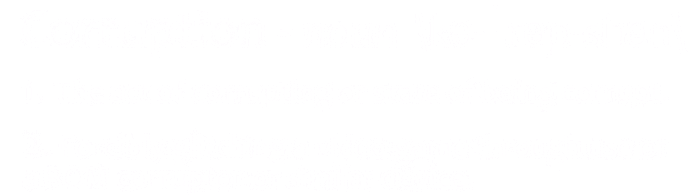

# Introduction

<figure><figcaption></figcaption></figure>

**Please note that this wiki is still heavily in development.**

Videogame corruptions, or the act of "corrupting games", is the process of purposely breaking a game, usually with a program called a corruptor. This program can modify a game's data, and sometimes memory, to produce unexpected [graphics](https://youtu.be/1YCfk1FZ7I8?t=215), [gameplay](https://youtu.be/H\_jvZQgLyaE?t=195), or [audio](https://www.youtube.com/watch?v=CzKD52Vvxd8). Often resulting in [hilarity](https://www.youtube.com/watch?t=198\&v=W545DP8CmWQ) and or [invoking Satan](https://youtu.be/wtql-ZllYZ8?t=9).

Of importance though is that due to the random nature of corruptions, screen flashing is common. **If you are epileptic, corruptions might not be for you.**

## Types of corruption

### Visual

2D and 3D visuals can be affected by corrupting a game. For example, if you were to corrupt a sprite on the SNES it could result in different colors, offset pixels, flipped textures, or a change in hue. If you were to corrupt a model in a 3D game it could result in stretched, distorted, flat, or just plain broken polygons and mesh.

####


Mario's head mesh totally mashed up from Super Mario 64 on the N64. Source: (from Vinesauce in 2013)


### Audio

Corrupting a game can modify its audio and music, depending on how you corrupted the game. For example, if you corrupted a SNES ROM and modified music data it can crackle, scramble, pitch up or down, slow down, speed up, change the track entirely, or all at the same time.


The startup music to Donkey Kong Country for the SNES corrupted. Source: (From Vinesauce in 2013)


### Gameplay

Gameplay corruptions happen when a gameplay mechanic is altered by a corruption which can result in anything from misplaced characters to the player being able to jump 10 times higher than usual. Gameplay corruptions are not as common as audio and video corruptions because it requires game code to be altered while still run correctly.


"The car shouldn't have phased through those trucks like that". Source: (From BitRain in 2016)


## A warning

While corruptions are great fun, they can be a great danger to both you and your computer.

Sometimes when corrupting games a wild stretching polygon or a broken color palette can fill your screen and flash rapidly, which could cause epilepsy in some people. **If you are epileptic, corruptions might not be for you.**

When corrupting certain games on certain platforms you may encounter a blue screen of death (BSOD), while these are very rare and don't have any major adverse effects on your computer, nothing gets in the way of a BSOD and it will restart your computer. Be sure to save anything you are doing prior to corrupting.

Corrupting system processes? Not a good idea. If you really wanted to, do it in a virtual machine.

**Never ever corrupt an online game**. Doing so will adversely effect the experience of other players, lead to the banning of your account, and harms the reputation of RTC and corruptions as a whole.
