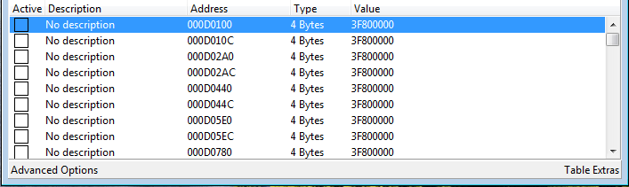

# Cheat Engine


While this method for corrupting Windows Games/Programs still work, we suggest using the [Real Time Corruptor](../rtc/) with ProcessStub for a more automated experience.



[rtc](../rtc/)


###

### Cheat Engine Guide for 3D PC Games

**Author:** Eric "Dark Byte" Heijnen\
**Source:** [https://github.com/cheat-engine/cheat-engine](https://github.com/cheat-engine/cheat-engine)\
**Download:** [https://github.com/cheat-engine/cheat-engine/releases](https://github.com/cheat-engine/cheat-engine/releases)

> _Cheat Engine is an Memory Hacking Software for the_ [_Windows_](https://github.com/cheat-engine/cheat-engine/releases)_,_ [_OSX_](http://www.cheatengine.org) _and_ [_Android_](http://forum.cheatengine.org/viewtopic.php?t=579943)_, it scans what a program has loaded on a computer's memory (RAM) when it's running and allows you to edit all the values a program has on memory. Normally Cheat Engine is used to cheat in video games like give you infinite health, thus the name._

Due to Cheat Engine having many features for game hacking and memory editing, this wiki article will focus on the corruption aspect of Cheat Engine and the basics of the software to corrupt with it. Please visit the Cheat Engine Wiki for more information on the memory hacking and scripting side of Cheat Engine here: [http://wiki.cheatengine.org/](http://wiki.cheatengine.org/)

## Index

* [**Index**](cheat-engine.md#index)
  * [**Functions**](cheat-engine.md#functions)
  * [**Process Hooking**](cheat-engine.md#process-hooking)
  * [**Memory Scanning**](cheat-engine.md#memory-scanning)
    * [Scan Option](cheat-engine.md#scan-option)
    * [Scan Range](cheat-engine.md#scan-range)
  * [**Found Values**](cheat-engine.md#found-values)
  * [**Active Table**](cheat-engine.md#active-table)
  * [**Common Hex Values**](cheat-engine.md#common-hex-values)
  * [**Quick Corruption Setup**](cheat-engine.md#quick-corruption-setup)
  * [**Corrupting Emulated Games**](cheat-engine.md#corrupting-emulated%20games)
    * [Little Endian Values](cheat-engine.md#little-endian-values)
  * [**Tips**](cheat-engine.md#tips)
  * [**Warnings**](cheat-engine.md#warnings)
  * [**References**](cheat-engine.md#references)
  * [**Videos**](cheat-engine.md#videos)

## Functions 

### 

## Process Hooking

Hooking processes in Cheat Engine allows you to choose your target application or game for corruption. You can also hook emulators and even system processes.

### 

## Memory Scanning

Memory scanning scans the memory of the chosen application from the process list, there are many types of values you can scan however in the context of corruptions 4 byte values are mostly used. You can experiment with other types of values including strings if you want to replace text on screen.

#### Scan Option

If you are trying to pinpoint specific elements of a game to corrupt but can't find what they are, Cheat Engine gives you lots of flexibility with various scanning options and the ability to scan specific ranges (similar to how you can corrupt specific ranges in the VSRC).

First Scan options are:

* Exact Value
* Bigger than...
* Smaller than...
* Value between...
* Unknown initial value

After the first scan you can set the options for the 'Next Scan' which are:

* Exact Value
* Bigger than...
* Smaller than...
* Value between...
* Increased Value
* Increased Value by...
* Decreased Value
* Decreased Value by...
* Changed Value
* Unchanged Value
* Same as First Scan

All these options speak for themselves. Cheat Engine remembers the values found in the previous scan, allowing it to compare new values with the old ones and revert to a previous scan. It also remembers the values of the First Scan.

#### Scan Range

Cheat Engine only scans between the given range markers. Default are these From: 00400000 To: 7FFFFFFF If you know for certain that a certain address must be between two addresses, then you can change these markers and Cheat Engine will only search between those values.

## Found Values

After searching for a value it will show the results in the left panel. You can select groups of values by clicking on one value, holding shift and clicking another value, or select multiple individual values by clicking on values while holding Ctrl.

Move your selected values to the active table for editing by clicking the red arrow on the bottom right of the results table.

### 

## Active Table

The active table is where you can edit the properties of your selected/found addresses. You can edit the following properties:

* Description
* Address
* Type
* Value

In the context of corruption the Value is the most modified property for the most prevalent results.

## Common Hex Values

These values are best for getting good corruption results, after scanning for these values, move the found values to the active table and increase or decrease them by 1000 to see if they have any effect on the game.

`3c000000 - 3e800000`

`3e800000 - 3f800000`

`3f800000 - 40000000`

`40000000 - 40800000`

`40800000 - 42000000`

`42000000 - 47000000`

`bc000000 - be800000`

`be800000 - bf800000`

`bf800000 - c0000000`

`c0000000 - c0800000`

`c0800000 - c2000000`

`c2000000 - c7000000`

## Quick Corruption Setup

1. Select a process (game or emulator) from the process button in the top left corner.&#x20;
2. Tick the Hex checkbox next to the value input.
3. Input a value of your choice (ex. 3F800000).
4. Click on "First Scan".
5. After the first scan has completed, select several hundred values from the list by holding shift to select values in bulk.
6. Click on the red arrow in the bottom right of the found values table to move the values to the active table.
7. Select all the values in the active table with Ctrl+A and hit enter to change the values.
8. Add 1000 to the value and click OK.
   1. If nothing happened try change the value from "3F800000" to "3F900000" or to "3D800000".
   2. If a crash occurred you should try repeat the process from 1-8 with the same values but modify the value in smaller amounts, i.e: 3F800000 to 3F801000.
9. If you are unsuccessful with the chosen values, try another set of values and modify those instead.

You can experiment extensively with Cheat Engine because of it's high flexibility with memory editing so if you'd like to try the and corrupt a game with all of it's features please check the official Cheat Engine Wiki to learn more. [http://wiki.cheatengine.org/](http://wiki.cheatengine.org/)

## Corrupting Emulated Games

If you want to try corrupting emulated games in something like Dolphin, first check the architecture of the emulated console to see if uses Little or Large Endian values.

The Wii and the Wii U use little endian values so when corrupting with Cemu or Dolphin, use the values below.

#### Little Endian Values

`0000803F - 00002040`

`0000003F - 00000040`

`0000803E - 00004040`

`0000C03F - 00004040`

`00000040 - 00008040`

`0000A040 - 00000041`

`00002041 - 00000042`

`00000042 - 00000043`

`00000044 - 00000045`

`0000807F - 0000803F`

`000080BF- 000040C0`

`000000BF - 000000C0`

`000000C0 - 000000C1`

### Tips

* Depending on the game, un-checking the "Writable" and "Exectuble" options before doing the first scan can give you better values to corrupt with.

* If your game crashes and you don't want to lose the values you found, you can relaunch the game, choose it from the processes list again and click "Yes" when it asks if you want to keep the current address list/code list. However, this will only work if the addresses are static (colored green as opposed to black).

## Warnings

_**NEVER CORRUPT AN ONLINE GAME!**_

This will most likely result in you getting banned from the game's multiplayer network if there is any kind of anti-cheat mechanism involved. Corrupting Counter-Strike games will get you kicked or banned because of the Valve Anti Cheat system recognizing memory editing happening on the client side or that an external program has hooked the game process during a match.

_**CHEAT ENGINE CORRUPTION CAN CAUSE BSODs!**_

It's rare but you can cause the "blue screen of death" when corrupting with Cheat Engine, BSODs happening while corrupting almost never cause any long term damage to your OS, the only inconvenience being unexpected shutdowns.

_**LOWER YOUR VOLUME!**_

Sometimes when you're changing values one of those values will control the volume so you might accidentally tab back into the game to find the volume at 1000%.

## References

This wiki article is adapted from a guide written by BitRain [you can find here.](https://github.com/x8bitrain/corrupt-wiki/tree/430148d289135ba52a58a9e30a4c9ac95d616b76/assets/cheat-engine/corruption-guide.pdf)

BitRain's guide was inspired and adapted from CosmoCourtney's tutorial [video here.](https://www.youtube.com/watch?v=iLdrMNrwgRo)

## Videos



CosmoCourtney has a guide on how to use Cheat Engine to corrupt games, in this example Goat Simulator is corrupted.



A good example of what Cheat Engine is possible of when used on modern titles.
