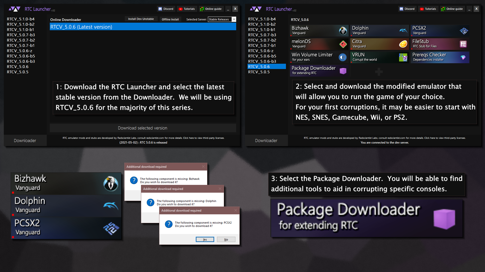

# Lesser known corruptors

* \*\*\*\*[**Index**](lesser-known-corruptors.md)\*\*\*\*
  * [Scares Scrambler](lesser-known-corruptors.md#scares-scrambler)
  * [Alice Corruptor](lesser-known-corruptors.md#alice-corruptor)
  * [Chain Chomp](lesser-known-corruptors.md#chain-chomp)
  * [Erosion-v4](lesser-known-corruptors.md#erosion-v4)
  * [ROM Poison](lesser-known-corruptors.md#rom-poison)
  * [The Haggleforth Rom Corruptor](lesser-known-corruptors.md#the-haggleforth-rom-corruptor)
  * [rcorrupt](lesser-known-corruptors.md#rcorrupt)
  * [oxidizer](lesser-known-corruptors.md#oxidizer)

### Scares Scrambler

**Author**: cocoatwiz \(scares\)  
**Tutorial**: [https://www.youtube.com/watch?v=MOQykOsMeEU](https://www.youtube.com/watch?v=MOQykOsMeEU)  
**Download**: [https://github.com/Cocoatwix/Scares-Scrambler-Build-13](https://github.com/Cocoatwix/Scares-Scrambler-Build-13)

> _The Scares Scrambler corruptor is a file corruptor written in python with a GUI interface and multiple configurable algorithms._

### Alice Corruptor

**Author**: AliceTS  
**Download**:



> Alice Corruptor is a real-time corruptor for PC games built on top of Cheat Engine. It predates the release of RTC's ProcessStub.

### Chain Chomp

**Author:** "Lafolie"  
**Source:** [https://bitbucket.org/Lafolie/chainchomp](https://bitbucket.org/Lafolie/chainchomp)  
**Download:** [https://bitbucket.org/Lafolie/chainchomp/downloads/ChainChomp-0.9.1.zip](https://bitbucket.org/Lafolie/chainchomp/downloads/ChainChomp-0.9.1.zip)

> _Chain Chomp is a plugin-based corruptor that is open source. This main concept of this corruptor is that operations on on a chain basis, where operations are driven from plugins, individually configurable._

### Erosion-v4

**Author**: juanmv94  
**Download**: [https://github.com/juanmv94/Erosion-v4](https://github.com/juanmv94/Erosion-v4)

> _A small file corrupter project from 2016 emerged from the need for an actual fast and advanced ROM and file corrupter. Only the binary was released, being this the first time the source code is available._

### 

### ROM Poison

**Author**: Coolcord  
**Download**: [https://github.com/Coolcord/ROM\_Poison](https://github.com/Coolcord/ROM_Poison)

> _ROM Poison is designed to be a simple, but powerful, ROM corruptor. Due to the nature of ROM corruptors, this can be used on any file, but it is intended to be used with video game ROMs \(such as NES, SNES, and N64 games\). It is written in C++11 using the Qt5 libraries, making it multiplatform._

### The Haggleforth Rom Corruptor

**Author**: RyanTheNerd  
**Download**: [https://github.com/RyanTheNerd/rom\_corruptor](https://github.com/RyanTheNerd/rom_corruptor)

> _A basic rom corruptor written in python. runs exclusively in command line and takes configuration of the corrution through a json file_

### rcorrupt

**Author**: xpcybic  
**Download**: [https://github.com/xpcybic/rcorrupt](https://github.com/xpcybic/rcorrupt)

> _A basic rom corruptor written in c. runs exclusively in command line with arguments_

### oxidizer

Author: ix  
Download: [https://github.com/ix/oxidizer](https://github.com/ix/oxidizer)

> _A basic rom corruptor written in rust. runs exclusively in command line with arguments_

### Alice Corruptor

