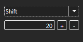

# VineCorrupt

### VineCorrupt

**Author:** "Maiddog"\
**Source:** [https://github.com/Roughsketch/mdcorrupt](https://github.com/Roughsketch/mdcorrupt)\
**Download:** [http://www.maiddog.com/projects/corrupter/download.php](http://www.maiddog.com/projects/corrupter/download.php)

> _VineCorrupt is a multi-system corrupter designed to work with game systems ranging from NES to Wii with further inclusive development for other systems. VineCorrupt features opcode and file protection for its supported systems to minimize crashes. Each system has a different protection protocol according to their instruction set or file type to prevent crash inducing modifications. VineCorrupt also features the ability to corrupt specific files within a disc through a directory structure._

#### Index

* [**Index**](vinecorrupt.md#index)
  * [**Functions**](vinecorrupt.md#functions)
    * [ROM File](vinecorrupt.md#rom-File)
    * [Extract To](vinecorrupt.md#extract-to)
    * [Emulator](vinecorrupt.md#emulator)
    * [Save](vinecorrupt.md#save)
    * [Save Last](vinecorrupt.md#save-last)
    * [Load](vinecorrupt.md#load)
    * [Corrupt](vinecorrupt.md#corrupt)
    * [Run Emulator](vinecorrupt.md#run-emulator)
    * [Miscellaneous Files](vinecorrupt.md#misc-files)
  * [**Byte Corruption**](vinecorrupt.md#byte-corruption)
    * [Step Size](vinecorrupt.md#step-size---hex)
      * [Start Byte](vinecorrupt.md#start-byte---hex)
      * [End Byte](vinecorrupt.md#end-byte---hex)
      * [Total Bytes](vinecorrupt.md#total-byte---hex)
      * [Bytes Corrupted](vinecorrupt.md#bytes-corrupted)
      * [Corruption Selection](vinecorrupt.md#operation-select)
      * [Corruption Value](vinecorrupt.md#corruption-value)
  * [**Byte Operations**](vinecorrupt.md#byte-operations)
    * [Shift](vinecorrupt.md#shift)
    * [Swap](vinecorrupt.md#swap)
    * [Add](vinecorrupt.md#add)
    * [Set To](vinecorrupt.md#set-to)
    * [Random](vinecorrupt.md#random)
    * [Rotate (L/R)](vinecorrupt.md#rotate-lr)
    * [Logical AND](vinecorrupt.md#logical-AND)
    * [Logical OR](vinecorrupt.md#logical-OR)
    * [Logical XOR](vinecorrupt.md#logical-XOR)
    * [Logical Complement](vinecorrupt.md#logical-complement)

#### Functions

This section goes over the functions of VineCorrupt.

**ROM File**

Choose a ROM file by selecting "Browse." The ROM's directory path will be displayed once the ROM has been selected.

**Extract To**

Choose a directory by selecting "Browse" to extract the contents of the selected ROM. This directory's files will be the target for corruption.

**Emulator**

Choose an emulator by selecting "Browse" to point to the emulator that runs the ROM files from the current tab. The selected emulator will remain selected for the specified system until the user chooses another one or VineCorrupt is updated.

**Save**

Shows a display box with a code that can be loaded to restore the current settings. These values correspond to the current corruption options.

**Save Last**

Once a ROM is corrupted, you can save it to a custom directory with this option. It will be deleted from the corrupter directory afterwards.

**Load**

Shows a display box that allows the user to enter a code generated by a "save" operation. Submitting a code will restore previous corruption settings. This code corresponds to the current corruption options.

**Corrupt**

Starts the corruption process with the current settings. If an "Extract To" directory is listed, the files within this directory will be corrupted.

**Run Emulator**

If an emulator is selected, it will attempt t o run the emulator with the given ROM as an argument. If an emulator has already been run this way, it will be closed. The option does not work with all emulators and the run/auto-close feature may not operate properly.

**Miscellaneous Files**

VineCorrupt supports non-specific file corruption for unsupported systems. It is not recommended to use this function if the supplied file is already supported by a VineCorrupt system due to the built-in file protection. Miscellaneous file corruption is performed in the same manner as supported system file corruption.

#### Byte Corruption

This section goes over the "Corruption Options" section of VineCorrupt.

**Step Size**

The amount of space to skip between each corruption.

**Start Byte**

The offset into the ROM where the program will start corruption.

**End Byte**

The offset into the ROM where the program will stop corruption. Setting this value to 0 will corrupt from the Start Byte to the end of the file (similar to "Auto-end").

**Total Bytes**

This displays the total bytes of the ROM in hexadecimal once the file has been selected.

**Bytes Corrupted**

This displays the total bytes corrupted with the current settings after the ROM has been corrupted.

**Corruption Selection**

The drop down box lists all the current corruption types. The currently selected one will be applied after hitting Corrupt.

**Corruption Value**

The Corruption Value is currently unlabeled and is located under the corruption selection drop down box. This value modifies byte operations.

#### Byte Operations

This section goes over the byte operations of VineCorrupt. For examples of these operations see Maiddog's [Help Section](http://www.maiddog.com/projects/corrupter/help.php#tab-help-2)

**Shift**

Shift grabs a byte a \[Corruption Value] distance away and puts it in the current position.

**Swap**

Swap grabs the current byte and a byte of \[Corruption Value] distance away and swaps their values.

**Add**

Adds the \[Corruption Value] to the current byte.

**Set To**

Sets the value of the current byte to the value of \[Corruption Value].

**Random**

Random generates a random value and places it at the current byte. Random does not use the corruption value.

**Rotate (L/R)**

Rotate performs a bitwise rotation of the current value by a distance of \[Corruption Value].

**Logical AND**

Performs a logical AND operation at the current byte with the \[Corruption Value].

**Logical OR**

Performs a logical OR operation at the current byte with the \[Corruption Value].

**Logical XOR**

Performs a logical XOR operation at the current byte with the \[Corruption Value].

**Logical Complement**

Changes the current byte to its logical complement. Complement does not use the corruption value.

*
  * \*

Write up by TechSupportSparky\

