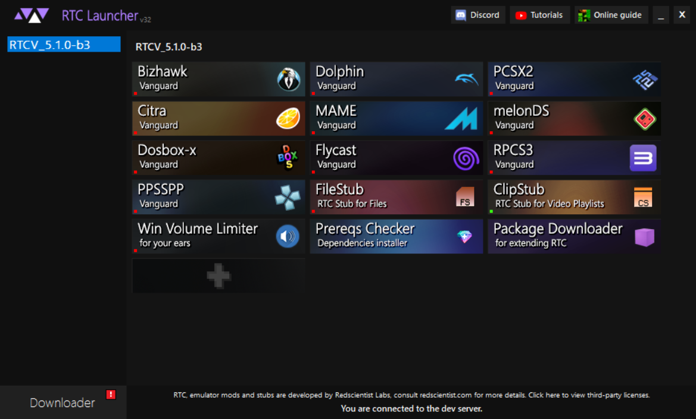

# Introduction

The Real-Time Corruptor is a suite of tools and mods for emulators that allows a complete takeover of videogames. It is distributed through a tool called the RTC Launcher, available on [Redscientist Labs](introduction.md#download-https-redscientist.com-rtc). The Launcher is a portable application that can let multiple versions of RTC Coexist and helps managing emulators and assets.

## Download: [https://redscientist.com/RTC](https://redscientist.com/rtc)

**All programs from the RTC suite of tools are Open Source and available at:** [**https://github.com/redscientistlabs**](https://github.com/redscientistlabs)

First, let’s go over the basic fundamentals of how this launcher functions.

### RTC Launcher

On the left side of the RTC Launcher, you get to choose which version of the RTC Core in use. Sometimes, RTC updates can and will break compatibility with older emulators and stockpiles so the availability of versions in the Launcher is the ultimate flexibility for compatibility.

When you click on an emulator icon, it will ask for downloading it from the server. Each emulator and component come with their own set of software licences and cannot be bundled with the Core.

When installing a new version of RTC, you may be prompted for importing emulators from older versions. This allows you to import emulator configurations from a previous RTC version. If the Launcher does not suggest you to import it, it means that the Emulator itself isn't compatible with the new version and must be re-downloaded.

#### Developer versions

In the Downloader tab, you can switch between distribution servers. Beta/Developper builds are available on the Developper server. An "Unstable" canary build is also sometimes available through the "Unstable" option.

### Quick Start

The Real-Time Corruptor was designed with ease of use in mind, if you want to get right into the action simply start an emulator from the launcher, load a ROM and click “Easy Start” then "Start with Recommended Settings" and you are away! (_Instant results not always guaranteed. Some emulators require bios or firmware files which you must acquire legally)_

Video game corruption happens when an emulated video game's program files are altered, either in the emulated game’s memory (RAM) or in the ROM itself. A real-time corruption is when the corruption itself occurs while the game is running or when the effects can be altered on the spot.

**RTC** is a collection of modified emulators and stub tools that integrate our corruption software via a solution we called Vanguard. This means that any emulator or program that is modded with Vanguard _should_ be compatible. Every system's memory areas are detailed as a series of zones known as Memory Domains. The corruption will be generated for the selected domains in the main window.&#x20;

### Differences from classic file corruptors

What is usually known as an iteration in static corruptors, is called a Blast in the RTC. A blast consists of a series of operations that are to be applied in the data located on the emulated game’s memory banks. (RAM, VRAM, ROM, etc.)

**The Auto-Corrupt function** attaches the blast generation to the emulated game’s clock. Smaller blasts on a fast clock will create a constant flow of randomly generated corruption. This flow can be controlled by three parameters: The **Error Delay,** which is a divider linked to the game clock, The **Intensity** which is a multiplier for the number of corruption units to be generated (which depends on the selected engine). The **Blast Radius** determines how the corruption is spread on the selected domains.

