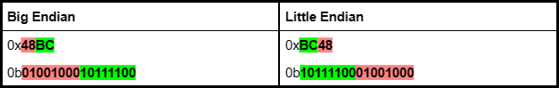

# How to make Passthrough Lists

By TomatoServal

## Prerequisites

* A basic understanding of computer architecture, including registers, opcodes, bits, etc.
* Previous experiences with making lists for RTC

## Introduction

The Vector Engine in RTC allows users to replace data structures (such as data types, instructions, etc) with other data structures inside a game. More advanced lists use a component called the **BitlogicListFilter** and it can do more than just a simple replacement. It can alter specific components of an instruction as well. One can use this for special lists called Passthrough Lists. In this short tutorial, I will explain how to make them for yourself in RTC.

\

\*NOTE: You must look up the instruction set for the desired system. If you are unsure, use the following prompt in a Google search: “**SYSTEM** cpu.” Then, search for the architecture. In addition, you need a basic understanding of computer architecture. Now, let’s get started :)

## Overview

### How Do Passthrough Lists Work?

As mentioned, passthrough lists allow RTC to alter specific instruction components in a program. What does that mean?

<figure><figcaption></figcaption></figure>

Most CPUs need two types of information in an instruction:

1. OPCODE - The specific operation the CPU needs to perform
2. OPERANDS - The data the CPU manipulates during execution

Let’s say you wanted to add two numbers together: 5 and 6. On paper, you’d write it as 5+6. A CPU would interpret the addition sign as the OPCODE and the numbers as the OPERAND.

Passthrough lists preserve specific components of these instructions. You can denote these bits/bytes using the (**#**) character in the list file. As such, you can swap key components of opcodes called by the processor. For example, you can alter the registers in a load instruction, replacing important data with garbage. Such lists allow for more unique results compared to the typical \[Limiter: Load -> Value: NOP].

Don’t mistake the (**#**) symbol for the (?) symbol. A (**?**) assigns a random value to the bit, allowing for a potential change. The (**#**) prevents this scenario from happening. To prevent any further confusion, I will refer to the (**#**) character as the static symbol and the (**?**) character as the variable symbol.

### Naming your Lists

Whenever you make a list, its name should be easy to understand. The corrupter should be able to answer the following three questions, which I will refer to as identifiers:

1. Which system should I use?
2. Which instructions will this list target?
3. How will this list affect the targeted instructions?

The first two identifiers follow similar guidelines as listed in the simple tutorial. The last one relates to passthrough lists specifically.

When naming your list, provide all these identifiers as concisely as possible. You can give it any name if it explains the list’s function. If you feel the name needs more explanation, you can utilize comments in the list file (I'll explain later).

\

## Simple Tutorial/Instruction-specific List:

In the following tutorial, I will make a **\[MIPS]\_BC\_REGISTER** list. This list aims to replace the registers that conditional branch instructions execute, e.g., branch if equal, branch if greater than, etc. We will disregard any “jump” instructions, as they execute regardless of any condition or state. This list applies to all systems that utilize a MIPS instruction set, which contains the N64, PS1, and PS2.

### Step 1: Finding the Opcodes

First, we must search for the instruction set online. The website **must** include opcodes, which is a string of binary numbers in the following format: 100100100101. Do NOT use any assembly code in the following format: beq **rs**,**rt**,**OFFSET**.

The rs, rt, and offset fields in the following example represent variables that can change (registers, addresses, etc.). These are the exact fields we will target later on in this demonstration. Once you find a valid website, you can create your lists.

<figure><figcaption></figcaption></figure>

<figure><figcaption></figcaption></figure>

### Step 2: Creating the List File

To start, we must create the file where we store lists. You **must** access the “VERSIONS” folder of RTC on your computer. Go to the following location: RTCV\_**XXX**\RTCV\RTC\LISTS. Next, create a new text file, name it appropriately, and open it. Then, paste **@BitlogicListFilter** at the top of the file.

NOTE: You can use comments in these lists by starting a line with //. They help explain the function of your list and highlight what you still need to do.

\

PRO TIP: You can go to your RTCV Versions folder by right-clicking the version in your Launcher and then selecting “Open Folder.”

### Step 2.5: Determining Endianness

RTC formats list entries in _Little Endian_ format by default. You can add an underscore at the beginning of your text file if you want all instructions to use a _Big Endian_ format. It makes copying easier since most websites show them in this format. However, plans are in place to change this system. Personally, I format my lists in _Little Endian_ to future-proof them. As such, I will use this format in the example list in Step 3.

To convert between the formats, you must put all bytes in reverse order. Below is a table representing data values in both endian formats:

<figure><figcaption></figcaption></figure>

In this example, we have a 16-bit word, both in hexadecimal(0x) and binary(0b). The most-significant byte is highlighted in green, while the least-significant byte is highlighted in red. The two bytes change locations, depending on their endianness.

### Step 3: Adding Opcodes to the List

Now that we have our website and lists, we may add our opcodes to the passthrough list. We must locate all conditional branch instructions on the site and copy them into the list. Note that for each entry, we must include _0b_ if our items are in binary and _0x_ if they’re in binary.

Below is the instruction in question:&#x20;

<figure><figcaption></figcaption></figure>

In this example, the register fields (**rs** and **rt**) are 5 bits long, while the **offset** field is 16 bits long. Since we want to change the registers, we will replace every register bit with a _variable symbol_ in the list. For the offset, we will replace every offset bit with the _static symbol_. This will prevent these bits from changing when using the list. After inserting the new characters, our current list file will look like this:

<figure><figcaption></figcaption></figure>

However, if you notice, our entry is in Big Endian format. If we want to convert the following into Little Endian, we must reverse the order of bytes. As a result, we get the following:

\

<figure><figcaption></figcaption></figure>

Using this method, we can convert the remaining conditional branch opcodes to get the following file:&#x20;

<figure><figcaption></figcaption></figure>

We have now created the lists. To use it, place **\[MIPS]\_BC\_REGISTER** as both the limiter and value list.&#x20;

That concludes the simple tutorial. You can use this method for any system. However, you can do more with passthrough lists than just this.

## Advanced Tutorial/General Lists:

You don’t NEED to use passthrough lists with themselves. You can use it with ANY list as the limiter. Therefore, you can utilize standard RTC lists in tandem with passthrough lists, resulting in fewer lists.

In this section, you will need two lists:

1. A regular list with all conditional branches
2. A passthrough list swapping the registers.

We can utilize the list in the simple tutorial for both with some changes. For our first list, we will copy **\[MIPS]\_BC\_REGISTER** in the current directory and rename it to **\[MIPS]\_BC**. Then, we will open the text document and replace all _static symbols_ with _variable symbols_. When you finish, it should look like the following:

<figure><figcaption></figcaption></figure>

Creating our second list will require different changes. We will, again, copy **\[MIPS]\_BC\_REGISTER** in the current directory but rename it to **\[MIPS]\_ReplaceRegister**. Next, we will open the file. However, we will delete all opcodes except for **beq**. Finally, we will replace all numbers with the _static symbol_. When you finish, the second list should look like this:

<figure><figcaption></figcaption></figure>

You are now ready to use these lists. Just place **\[MIPS]\_BC** as the limiter list and **\[MIPS]\_ReplaceRegister** as the value list.

This method is more complicated and abstract compared to the simple tutorial. Yet, it is also more practical. CPUs follow a universal arrangement for each instruction. Regarding MIPS, there are three instruction types: R-Type, I-Type, and J-Type. Conditional branches fall under the I-Type, which includes a 6-bit opcode, two 5-bit registers, and a 16-bit immediate/offset value.

<figure><figcaption></figcaption></figure>

Our register replacement list will work for all I-Type instructions. To make our list more universal, I can rename it **\[MIPS]\_ReplaceRegister\_Itype** to highlight this fact.

Creating lists by type rather than opcode will require fewer lists. There is a common instruction arrangement for each CPU. You will need to research your desired system thoroughly to find it, but you will surely reap the benefits.

## Conclusion

To conclude, passthrough lists are very versatile. Using the static symbol (**#**), they can target and change specific instruction components. You can either use them with themselves or in tandem with regular lists.

There are many ways to make passthrough lists than the ones mentioned in this tutorial. Try to experiment with them on your own. Happy testing :)

\
One final PROTIP: If you need to flip the endianness of an entire list, you can add \_ at the beginning of the filename to make RTC auto-flip the endianness when loading it.

\
