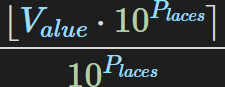

# Java Corruptor Plugin

## Introduction

The Java corruptor is a plugin made to easily corrupt games written in Java. It was written with similarity to the usual RTC experience in mind, so your prior experience with RTC will be applicable when using it. This overview will cover the behavior of the different engines, important facts about Java to keep in mind, and notable differences between the Java corruptor and RTC.

## Prerequisite Java information

The JVM (Java Virtual Machine) is a stack machine, which means that each instruction ran modifies a stack of values. An instruction might switch items around on the top of the stack, remove an item from the stack, add one, add/remove multiple, or any combination of these. It's important that when you corrupt the bytecode, it will result in the stack having the same value on it as it did originally. If you run an instruction that removes a value from the top of the stack, but there are no items left, Java will detect the possibility of that before the program even starts. If you try to return from a method with more than one value on the stack (or any at all in the case of a void), the program won't start. If you replace an instruction that takes a different type of value from the stack than the original, the program won't start either. You can find a list of each instruction, its operands, and its stack behavior [here](https://en.wikipedia.org/wiki/List\_of\_Java\_bytecode\_instructions).

## Normal Usage

The Java Corruptor Plugin makes use of FileStub for loading files as input. Its interface is loaded from the Custom Layouts item in the Main menu. The Corruptor comes with custom replacement controls that replaces the main window's usual tools.

## Java blast units

A Java blast unit includes the name of method to corrupt, the index of the instruction to corrupt, a number of instructions to replace at the index, and a list of instructions to place there instead. If the `Replaces` value is set to 0, the instructions will be inserted before the index without removing it.

## General Parameters

**Intensity**\
The approximate percentage of instructions to corrupt.

**Launch a program after corrupting**\
Lets you choose a program to launch after corrupting the game. For example, you might write a batch script to replace the old JAR file and then launch the game.

**Use last seed**\
Lets you corrupt the game with the same random values as last time. This was added for debugging purposes, but can be handy to more easily re-roll a corruption with different settings.

## Re-rolling corruptions

The Java corruptor plugin has a different method of re-rolling blast units. Each unit has the engine used to create it saved within, as well as the engine's settings. You can edit a unit's settings by right-clicking it in the blast editor and clicking "Modify Re-roll Settings". Besides that, units are re-rolled the same way as you normally would in RTC.

## The disassembler

The disassembler can be a useful tool when editing blast units or writing a custom engine. It allows you to read the Java bytecode instructions within a method. It can be opened by clicking the "Open Disassembler" button in the general parameters or by right-clicking a unit's method and clicking "Disassemble this unit's method".

## Engines

Each engine has an effective default configuration except for Vector engine and Nuker engine.

### Vector Engine

This engine replaces any of the selected limiter instructions with any of the selected value instructions. It only includes instructions that do not have any operands.

**Replaces:** 1 instruction\
**Creates:** 1 instruction

### Arithmetic Engine

This engine adds an extra math operation to be performed on the result of an arithmetic instruction.

**Limiters**\
Which operations should be corrupted.

**Operations**\
What operations can be added after.

**'Int', 'Float', 'Long', and 'Double' check boxes**\
These let you choose.which types should be corrupted. Floats and doubles are generally the best to corrupt. Checking 'int' will also corrupt math done on shorts and bytes.

**Minimum and Maximum**\
The engine chooses a random value between these numbers to perform the new operation with. For ints and longs, the value is rounded down.

**Randomize Value at Runtime**\
This decides whether the extra operation should be performed with a constant value, or with a different one between the minimum and maximum each time the corrupted code is run.

**Replaces:** 1 instruction\
**Creates:** The original instruction, and with 'randomize value at runtime' off, 2 more. With 'randomize value at runtime' on, 9 more.

### Function Engine

This engine replaces calls to any of the selected limiter functions with any of the selected value instructions. The "POP,random()" option discards the value that would be passed to the original function, and replaces the function with Math.random() which returns a value between 0 and 1.

**Replaces:** 1 instruction\
**Creates:** 1 instruction

### Custom Engine

This engine allows you to create your own engine with regular expressions (regex). You can right the Corruption Engine title bar to pop the window out and resize it for more space, and you can resize the two sections by clicking and dragging between the text boxes. Before corrupting, use the "Check For Errors" button to ensure that the engine won't generate any invalid instructions. It will run your engine on every instruction in the currently loaded JAR, then report back with which lines produced errors and why. If your engine produces invalid instructions in the test, but you decide to corrupt with it anyway, expect a cloud debug box to show up when the plugin fails to parse a broken instruction string.

**Find**\
A list of instructions to corrupt. Opcodes must be in ALL CAPS. All text in a line after `//` is ignored. Multi-line comments are also supported with `/*` at the beginning and `*/` at the end. Regexes should be put in \<angle brackets>. You may not use named groups within your find group, because they require usage of the `<` and `>` characters. Regex subroutines are also not allowed because .NET does not support pattern recursion. Prior to corrupting, all `$`s at the ends of lines are removed, the first line of the find section has `^` prepended, and the last has `\r?$` appended.

**Replace**\
A list of instructions to replace the original ones with. Opcodes must be in ALL CAPS. You can reference capture groups in the original like `<$1>`. Multiple references combined like `<$1$2$3>` will not work. To generate a random single-precision floating-point number, use the syntax `<randomF 0.5,2.5>`. You can do the same with doubles, longs, and ints with `randomD`, `randomL`, and `randomI`. Your engine can also employ some basic logic. Say you want to add a random number between 1 and 10 to floating-point addition instructions every time the code runs. Without logic, you'd only be able to do it for doubles or floats at a time, since you would need to convert the result of `Math.random()D` to a float only if the original instruction was FADD. If you have a find section like `<(F|D)ADD>`, you could add the code `<if $1 == F>D2F<else>NOP</if>` to only output a conversion instruction if necessary. If you need logic at runtime, you'll have to use labels. You can't just have a static name for each label, though. It will appear to function at low intensities, but if multiple points in the same method are corrupted, more than one of the same label instruction will be added, and the corruption will fail. Instead, use `<label YourLabelName>` to name your labels. For example:

```
INVOKESTATIC java/lang/Math.random()D
LDC 0.5D
DCMPG
IFLE <label LessThanHalf>
FSUB //if random() was >= 0.5, FSUB
GOTO <label MoreThanHalf>
<label LessThanHalf>: //if random() was < 0.5, FADD
FADD
<label MoreThanHalf>:
```

This will ensure that every time the corruption is applied, a unique set of labels is used.

**Replaces:** Depends\
**Creates:** Depends

### String Engine

This engine edits text within the code. It is quite crash-prone, and better results can be gained from Nuker engine's string tab.

**Characters**\
The text the engine will use when corrupting. Each mode uses them differently.

**Percentage**\
The (approximate) percentage of the string to corrupt.

**Nightmare mode**\
Replaces characters from the original string with random characters from the 'characters' box. Example: "This is a string of text" > "Thxs iska splang ojptext"

**Swap mode**\
Swaps characters with each other around. Example: "This is a string of text" > "hTis ia srst ing xf teot"

**Cluster mode**\
Like swap mode, but only with adjacent characters. Example: "This is a string of text" > "hTis i sa stirng of txet"

**One-per-line mode**\
Replaces the whole string with one of the lines of text from the 'characters' box. Does not respect the percentage value. Example: "This is a string of text" > "This is the text on line 3!"

**Only Strings with Spaces**\
Makes the engine only corrupt strings that contain spaces. This tends to make the engine less crashy.

**Runtime Randomization**\
Makes a new random string each time the corrupted code is ran. Only works with Nightmare mode and One per line mode.

**Replaces:** 1 instruction\
**Creates:** Runtime randomization off: 1 instruction. Runtime randomization on: Depends

### Rounding Engine

This engine rounds various numbers to a certain number of decimal places.

**Kinds**\
Which sorts of numbers should be rounded Constants: unchanging numbers within the code Math operations: the results of math operations Variable loads: the values stored in variables, but only when they're loaded Field loads: the values stored in fields, but only when they're loaded Return values: the results of functions.

**'Int', 'Float', 'Long', and 'Double' check boxes**\
These let you choose.which types should be corrupted. Floats and doubles are generally the best to corrupt. For math operations, checking 'int' will also corrupt shorts and bytes.

**Operations**\
The operations to corrupt when "Math operations" is selected under 'Kinds'.

**Round to x decimal places**\
The number of decimal places to round to. Amounts of places between whole numbers won't work how you probably think they will. 0.5 rounded to the nearest 0.5 places is not 0.75. The formula used to round values is: !\[\[Equation.png]] You can visualize this by graphing it with the x axis as places and any number for value.

<figure><figcaption></figcaption></figure>

**Replaces:** 1 instruction\
**Creates:** Depends

### Nuker Engine

This engine removes all of the instructions from a method and makes it return a different value. When using this engine, the intensity determines the percentage of methods to corrupt rather than the percentage of instructions.

**Byte/Short/Int/Long/Float/Double**\
Pick a random number between the minimum and maximum and return that value. When "Runtime Randomization" is checked, the corrupted code will return a different random value each time it runs.

**Char**\
Pick a random character from the text box. When "Runtime Randomization" is checked, the corrupted code will return a different random character each time it runs.

**Bool**\
Return true or false, or pick randomly, depending which you have checked. When "Runtime Randomization" is checked, the corrupted code will pick randomly each time it runs.

**Void**\
Removes all of the code. Voids return nothing. Checking "Skip static class initializers" and "Skip class initializers/constructors" will cause the game to crash less often.

**String**\
Return a random string. If 'charset' is selected, it will return a string made of random characters from the text box that is as many characters long as the button says. If "one per line" is selected, one random line of text will be chosen. When "Runtime Randomization" is checked, a new string will be randomly selected/generated each time the corrupted code runs.

**Replaces:** 1 instruction\
**Creates:** 1 instruction
