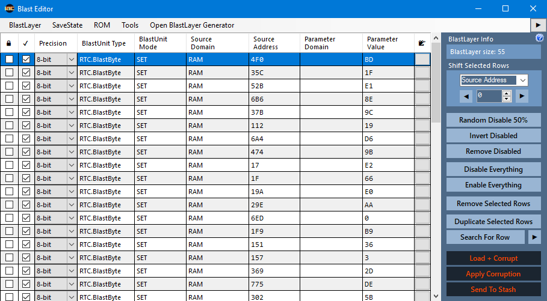
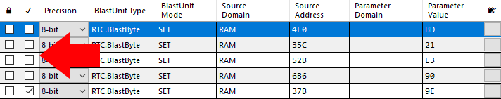
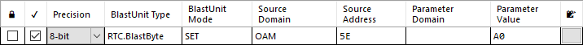

# Blast Editor

## **Note: This part of the guide is somewhat out of date (written for the 3.2X branch). Most topics still apply.**

The Blast Editor is a tool for manipulating a StashKey in the Glitch Harvester. This allows the user to edit, add, or remove effects from the BlastLayer.

### Index

* [**Index**](blast-editor.md#index)
  * [**Purpose**](blast-editor.md#purpose)
    * [Sanitize](blast-editor.md#Sanitize)
    * [Method](blast-editor.md#method)
    * [Editing](blast-editor.md#editing)
  * [**Functions**](blast-editor.md#functions)
    * [BlastLayer Info](blast-editor.md#blastlayer-info)
    * [Shift Selected Rows](blast-editor.md#shift-selected-rows)
    * [Disabling](blast-editor.md#disabling-functions)
    * [Searching](blast-editor.md#searching)
    * [Load](blast-editor.md#load)
    * [Apply Corruption](blast-editor.md#apply-corruption)
    * [Send to Stash](blast-editor.md#send-to-stash)
  * [**Unit**](blast-editor.md#category)
    * [Lock](blast-editor.md#lock)
    * [Selection](blast-editor.md#selection)
    * [Precision](blast-editor.md#precision)
    * [BlastUnit Type](blast-editor.md#blastunit-type)
    * [Source Domain](blast-editor.md#source-domain)
    * [Source Address](blast-editor.md#source-address---hex)
    * [Parameter Domain](blast-editor.md#parameter-domain---hex)
    * [Parameter Value](blast-editor.md#parameter-value---hex)
    * [Notes](blast-editor.md#notes)

## Purpose

The purpose of the Blast Editor is to provide the user with the ability to edit the corruptions they create. At a lower level, users may sanitize their corruptions to remove unnecessary memory writes. Experienced users may utilize their knowledge of memory to inject specific BlastUnits to obtain their ideal corruption.

#### Sanitize

Sanitizing corruptions is an important habit that should be regularly practiced. Not only will it remove unnecessary graphical glitches, deafening audio, and clown vomit, but also it will improve the overall stability of the game. It's no fun if you have a great corruption that can only be played for half a second before the game crashes!

#### Method

The BlastLayer size can vary from just a few Units to several thousand depending on the intensity of the corruption.

With a small number of units, the user may individually disable unnecessary memory writes by unchecking them.

With larger BlastLayer sizes, unchecking individual Units will take too long. Instead, use the Randomly Disable 50% button to disable half of the BlastLayer. Repeatedly disable 50% and remove half as long as the corruption persists after loading.

Use this method:

\[Random Disable 50%] then \[Load + Corrupt].\
Is the corruption (effect) still present?\
If Yes -> \[Remove Disabled]\
If No -> \[Invert Disabled] then \[Remove Disabled]

**Video example**



#### Editing

After a corruption has been reduced to a few Units, their settings can be changed on the fly through the Blast Editor. Changing options such as the BlastUnit Mode (SET, ADD, SUBTRACT, ETC.), tilting the Source Address, and changing Parameter Values can result in different variations on the corruption. To change a value, double-click on it to change the value and reload the corruption to see the new effect.

## Functions

#### BlastLayer Info

The BlastLayer Info provides details about the currently loaded BlastLayer. The size of the BlastLayer (total Units) is displayed here.

#### Shift Selected Rows

The Shift Selected Rows menu adjusts the selected option (Source Address, Parameter Domain, Parameter Value) through the drop down menu. The value will be decremented/incremented by the supplied step size.

#### Disabling

**Randomly Disable 50%**

Disables 50% of the BlastLayer. Typically used for sanitizing large BlastLayers.

**Invert Disabled**

Turns all selected Units off and all unselected Units on.

**Disable Everything**

Disable all Units.

**Enable Everything**

Enable all Units.

**Remove Selected Rows**

Deletes the highlighted Units.

#### Searching

The Search For Row button opens a pop-up box where the user may search for a Source Address, Parameter Value, Source Address Domain, Parameter Domain, Blast Unit Type, or Blast Unit Mode. The located value will be highlighted and all other Units will be deselected.

#### Load

The Load + Corrupt button runs the emulation with enabled Units applied.

#### Apply Corruption

The Apply Corruption button will inject the currently running emulation with the enabled Units in real time.

#### Send to Stash

The Send to Stash button sends the Units in their current state to the stash as a save state with a BlastLayer applied to it. Unselected Units will remain disabled, but they will not be removed.

## Unit

A Unit contains several bits of information. These are the functions and descriptions of a Unit's column parameters within the Blast Editor from left to right.

#### Lock

Locking a Unit will prevent its parameters from being modified by any automatic system such as "Randomly disable 50%" or "Reroll."

#### Selection

The check mark sets the Unit's enabled/disabled state. This will determine whether the Unit is loaded/applied to the emulation.

#### Precision

Precision sets whether the BlastUnit is of type 8-bit, 16-bit, or 32-bit precision.

#### BlastUnit Type

The type description for the BlastUnit. Options include BlastByte, BlastCheat, and BlastPipe.

#### BlastUnit Mode

The mode that the BlastUnit is set in. Options include SET, ADD, SUBTRACT, RANDOM, RANDOM\_RANGE, SHIFT\_LEFT, SHIFT\_RIGHT, REPLACE\_X\_WITH\_Y, and a number of bitwise operations. Typically the type is manipulated by the selected corruption engine.

#### Source Domain

The location that the Unit is corrupting in memory. Types are included but not limited to, ROM, OAM, RAM, etc.

#### Source Address

The address within the specified source domain that the corruption is applied at.

#### Parameter Domain

If the BlastUnit Type/BlastUnit Mode requires another memory location, the memory address for this parameter will be supplied in the parameter domain.

#### Parameter Value

The parameter used for the corruption generation. Depending on the corruption type, this value will mean different things. For example, in a SET BlastUnit Mode the parameter value will overwrite the value at the supplied source address.

#### Notes

Allows the user to enter notes about a specific Unit.

Write up by TechSupportSparky 
