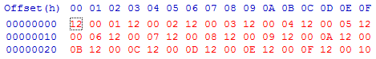

# VMD Generator (Advanced)

### VMD Generator Interface

**This intermediate guide will assume some working knowledge of the Real-Time Corruptor, as well as a basic understanding of Hex notation (0x).**

_Alternatively, if you don't feel confident enough with the full VMD Generator interface, a simpler interface named "Simple VMD Generatior" is also available for experimenting. Keep in mind that it does not have all of the functions from the regular VMD Generator._

_The examples shown below use BizHawk as an example Emulator but can be applicable to any program that implements Vanguard_

### What are VMDs?

**VMD** stands for "Virtual Memory Domain." It is a user-defined area of memory in which you can force RTC to limit its activities. VMDs take corrupting to the next level, allowing you to hone-in on known memory locations, such as where the game’s graphics are kept, or where a character’s stats are listed, and forces all blasts to target that specific area for consistent results.

RTC comes with a pre-defined set of these called simply Domains. That’s this stuff:

Every system supported by Bizhawk will have its own custom list, so you won’t always see the same names here. CHR and CHR VROM, for example, are specific to the NES system. You won’t find them working on a Playstation game.

One thing you will find on every system, however, is that one at the bottom: the **System Bus**.

### Understanding Domains

It’s important to have at least a general idea of what this is, because it will help you understand how everything else fits together.

When you load a game to corrupt, Bizhawk emulates the entire system it runs on, whether it be a SNES or a Playstation or an N64. That means it creates a virtual representation of the system’s memory spaces and everything they contain. We call these "busses." A system can have multiple busses if multiple pieces of its hardware have their own memory spaces. On the NES, for example, the System Bus is the CPU RAM, but you also have an entirely different bus which is the PPU RAM. Even game cartridges can have their own RAM space.

Although they interact with each other, it’s important to keep in mind that an address located at x100 on the System Bus, and that same address on the PPU Bus, are two entirely different addresses, like writing on the first line of two separate pieces of paper.

Let me show you some examples. The NES System Bus (i.e. the CPU RAM) is a grand total of FFFF (65535) bytes.

The Domain labelled **RAM** is located at the top from x0000 to x07FF, and is mirrored three times: at x0800, x1000, and x1800.

Cartridge ROM and RAM data, such as **PRG ROM**, are loaded into the x4020-xFFFF area.

**WRAM** is located at x6000-x7FFF.

← Visually, that would make the System Bus look something like this.

So when you select a Domain to corrupt in RTC, what you’re actually doing is selecting the specific areas of memory in which bytes are corrupted.

With just the WRAM Domain selected, for example, all of your blasts are going to occur in the x6000-x7FFF range. It won’t touch anywhere else.

If you’ve understood this concept, you’re now ready to learn how to make and use your very own VMDs.

### Creating a VMD

You do this from the main RTC window. In "Advanced Memory Tools," select “VMD Generator.”

Now click "Load Domains" and the current system’s memory busses will be loaded in.

You’ll notice that RAM is the first in the list. This is no coincidence; remember I showed you how it appears at the very top of the System Bus memory space?

See the "Domain summary" below that? It tells you the size of the RAM Domain, x800 bytes, or as previously shown, x0000 to x07FF.

Word size and Endian type aren’t important for this guide, so let’s skip those for now.

Let’s also skip over "Set pointer" and “Add X bytes of padding” until later. For now, let’s just do something really simple: Adding addresses that will act as your memory space filter.

In the "Remove/Add addresses" box, you can list either single addresses (one per line) or ranges of addresses to specify which areas of the currently selected Domain you wish to edit.

One thing may be confusing at first, but it’s **SUPER** important to understand this: Remember when I said the same address on two different busses is like writing on two different pieces of paper? The same concept also applies to individual Domains. Using this tool, you can think of all these domains as having their own separate pieces of paper. So if you were to add the address xFF in this example, you’d be telling RTC to including address xFF of the RAM domain **ONLY**.

What if you put that same address, xFF, and had WRAM selected instead? Which address on the System Bus do you think you’d be telling RTC to use?

It wouldn’t be x00FF. It would be _x60FF_. Because remember, the WRAM domain begins at x6000 on the System Bus.

You might think this isn’t important to know, but if you’re using VMDs, then you’re probably also following some sort of RAM Map or specific offsets you’ve found online via Googling. And if they’re giving you addresses specific to a particular Domain such as WRAM, then that’s fine. That’s easy. Just plonk the address in, and you’re good to go.

**BUT!** Sometimes those addresses they’re telling you are specifying from the System Bus as a whole, not just an individual Domain therein. So when they tell you "Offset x6F20 is the character’s move speed," it’s up to you to figure out how to handle that information, because you can’t just put x6F20 in with the WRAM Domain selected. It won’t work!

Sure, that address falls within the range that WRAM sits on the System Bus (x6000-x7FFF). But remember, like all Domains, WRAM _has its own memory space_-- its own piece of paper. It’s not big enough to have an address x6F20 of its own, because it’s only x2000 bytes in size!

So how do you handle that? There’s two ways:

1. From the Domains dropdown menu, select **System Bus** and input the address: **x6F20**. That’s the easiest way.
2. However, you could also select **WRAM** as the Domain, and do a bit of maths to figure out what x6F20 minus x6000 is. The answer is **xF20**, so you’d put that in.

That’s all well and good, but really, what VMDs are best for are _ranges_ of addresses, not just single addresses themselves. If you just wanted single addresses you can do that easily enough in the Blast Editor. So let’s find out how to create a VMD that acts, for all intents and purposes, exactly like a Domain, with one important advantage: the ability to target _exactly_ the areas you wish to affect.

### Specifying Ranges

I’ve selected System Bus and given the Generator two ranges. These ranges span different Domains on the bus. The first is within PRG ROM, and the other is in OAM.

(Important note: ranges **exclude** the final byte, so in this example I’m actually specifying xA950-xAA3F and xF510-xF73F. You must always account for that!)

When you input a name and click "Generate VMD," it appears both in the list of selectable Domains (prefixed with \[V] to denote a custom Domain) and in the VMD Pool menu like so:

Now I can select my custom Domain and use it to blast just those areas of memory which I specified in the list. You can see the results of these blasts in the Blast Editor window. (The Blast Editor is accessed via the Glitch Harvester screen, by right-clicking the BlastLayer in the stash history or stockpile lists and selecting it from the context menu).

.png>)

But, hang on. Does something about the numbers in the "Source address" column seem wrong to you? I specified a range starting from xA950, so why is it blasting addresses of x27B and x2BA?

It’s because our VMD is behaving just like any other Domain. Offset x0 of our VMD corresponds to xA950 in reality, so when it says "Source address: 2" it really means xF698.

There’s a handy way to make this simpler for ourselves. From the Tools menu in this window, select "Rasterize VMDs."

See? That’s better. "Source Domain" has been rasterized to the System Bus, and the addresses are exactly what I had specified. This is just a visual thing, it doesn’t change what’s happening.

### Saving Your VMD

Now that you’ve created a VMD, don’t forget to save it! Any unsaved VMDs will be lost once you end the session. VMDs save as XML files, which can be shared with other people.

### Advanced Filtering

You’ve basically learned all there is to creating and using VMDs, but I just want to quickly show you how you can be even more selective with your ranges.

Let’s say you have a range and the data therein follows a strict pattern. Maybe it’s a list with a fixed-length header and then one byte specifying the value.

In this example, the header is 12 00, and then we have the value, starting with 01 and incrementing. Maybe this is an organised list of NPCs and instead of their usual order, you want to shuffle them around, so that instead of loading up NPC 01 the game instead loads up NPC 09.

You’d do this with a VMD, but there’s a problem in that blasting this range of data is going to inevitably corrupt those headers. You _only_ want to change the values, not the headers. So how do we do this?

Again, there are two ways. One of those ways will be much more suitable for this specific example, but depending on context, they are both very useful methods, so use whichever one makes your job easier.

**Method 1: Set Pointers.** In the VMD Generation menu, tick the "Set pointer every X addresses" box. What a pointer does, essentially, is filter to these addresses (on a value of 2):

So when you blast, address x0 is really x1, and address x1 is really x3, and address xC is really x17.

On a value of 3, it would filter to these addresses instead:

So when you blast, address 0x is really x2, and address x1 is really x5, and address xC is really x23.

In this example, that’s exactly what we want: all the value bytes, none of the header bytes.

**Method 2: Exclude specific addresses or ranges.** When generating your VMD, you could instead construct your list like this:

Remember the note about ranges excluding the final byte? So here, what I’m telling it is:

\-Add all the bytes from the range x0-x2F, but then...

\-Exclude the bytes x0, x1, x3, x4, x6, x7, x9, xA, etc.

In this example, I’ve specified them as small two-byte ranges, but if you really wanted to you could exclude them individually instead. Sometimes you might need to do it that way. Click the blue "?" icon for some more in-depth instructions about this.
