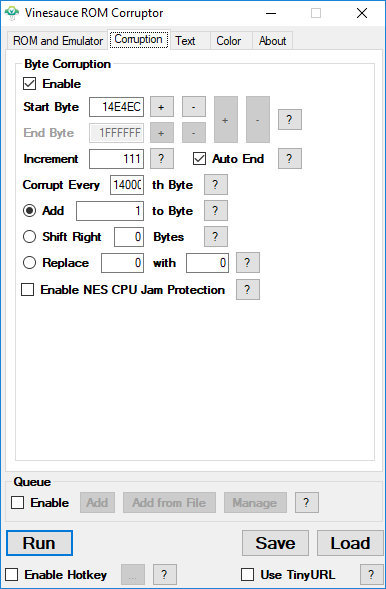
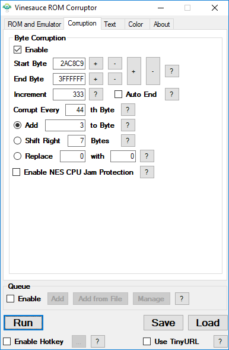

# Rom Corruption (Deprecated)


This guide is for corrupting roms directly with classic corruptors such as the Vinesauce ROM Corruptor and VineCorrupt. Some of this documentation can also apply to RTC when corruping the rom domain with the Blast Generator.



> #### The [Real Time Corruptor ](http://redscientist.com/rtc)supports this system natively through MelonDS. Some Vector Engine Lists are provided with it to provide support for the NintendoDS's architechture.
>
> ****[**You can view the wiki pages for the Real Time Corruptor here**](../../corruptors/rtc/)****


## Nintendo DS Rom Corruption

* [Index](nds.md#index)
  * [NDS Corruption with the Vinesauce ROM Corruptor](nds.md#nds-corruption-with-the-vinesauce-rom-corruptor)
  * [Setup](nds.md#setup)
    * [Picking Your ROM](nds.md#picking-your-rom)
    * [Games That Autosave](nds.md#games-that-autosave)
    * [Games That Save Manually](nds.md#games-that-save-manually)
    * [Games with Checksums](nds.md#games-with-checksums)
  * [Corrupting](nds.md#corrupting)
    * [Start/End Byte](nds.md#startend-byte)
    * [Standard Corruption](nds.md#standard-corruption)
    * [Corrupting with Save States](https://github.com/x8bitrain/corrupt-wiki/tree/430148d289135ba52a58a9e30a4c9ac95d616b76/Corrupting%20With%20Save%20States/README.md)
  * [References](nds.md#references)
  * [Video Examples](nds.md#video-examples)

## NDS Corruption with the Vinesauce ROM Corruptor

#### Guide Author: [Chris Byrne (Weinerless Steve)](https://www.youtube.com/user/Sevelix/)

Unlike traditional N64 games, DS can be corrupted both with and without save states effectively. Without save states, it corrupts like a normal game where corruptions are loaded from the start. When save states are used, it works more like N64 corruption where the only data that is being corrupted is data that is being loaded in real time. It is quite difficult to get results either way, as many games give poor results or have checksums you have to avoid. However, with patience you can have great results corrupting Nintendo DS games.

## Setup

Although there are multiple up and coming DS emulators, this guide is based on [version 0.9.11 of DeSMuMe](http://desmume.org/download/) and [version 1.2.2 of the Vinesauce ROM Corruptor](http://corruptedbytes.com/the-vinesauce-rom-corruptor). Earlier versions of the emulator should work the same. The best way to try corrupting a DS game is without save states, but you could set some during gameplay to go back to later. You’ll figure out the best places to put save states while experimenting during corruption, and we’ll go over this experimentation in later sections. It's also worth noting that the "+" and "-" keys are for fast foward and rewind, and to use your mic for a game like Nintendogs, you go into “Config”, then “Microphone Settings”. Depending on how your game saves, there are also additional steps to take.

### Picking Your ROM

For the best results, you're looking for something not too late after the DS's launch, with a file that isn't huge, with a minimal amount of AI on the screen. Games like Nintendogs, where there are three dogs on the screen at a time, work much better than games like Madden which has over 50 3D AI on the screen at once. Additionally, the larger or more detailed the models the better. This rule doesn't apply to 2D platformers with 3D characters. 2D games, isometric 3D games, and anything without a main character or object, such as a puzzle game, tend to not corrupt well. Even if you follow this criteria, many ROMs may not corrupt well and you’ll just have to move on to another one.

### Games That Autosave

When corrupting a game that autosaves, you need to wipe the save file path for the emulator, so that no corrupted saves are created. If a DS game detects a corrupted save, it will attempt to delete the save and often get stuck doing so, so you want to avoid creating them if you can. To do this, open DeSmuME and click “Config”, then “Path Settings”. Find the text box labeled “SaveRam”, make that box blank, and press OK. Just remember to restore the path to what it was originally if you want to use the emulator to play games normally again. You can also create a save state after the game checks for your save, and load that save every time you corrupt the game.

### Games That Save Manually

For games with manual saving, you'll be fine as long as you don't manually save the game while it is corrupted. Unlike autosaving games, it is recommended that you keep the SaveRam path at it’s default if you want to be able to save manually. For a game like Tomodachi Collection where you are punished for turning the game off without saving too many times you'll want to save the game, shut off the emulator, turn it back on, and make a save state on the start screen. Load this every time you start the game, corrupted or not (unless of course you want to load a state that takes you to a different part of the game). If you save the game again, make sure you replace the start screen state with an updated one. Make sure you don't load old states as well, as this will revert the game to the amount of progress made when you made that state. You can undo this by loading the newest state you made.

### Games with Checksums

Some games will also display a stop screen if they detect that the checksum is off in any way, which will happen if the game is at all corrupted. With some games, you can circumvent this by putting a save state past the checksum point. In other games, it does this constantly and there’s nothing you can do, just try another game.

## Corrupting

There are two methods of corruption used in NDS corruption. Standard corruption is similar to what you would do with a NES/SNES but with a much less frequent corrupt every byte. Corruption with save states is more similar to N64 corruption, where you can set the corrupt every much lower than a standard corruption but because you use a save state, you are only corrupting what loads in real time such as model animations and audio.

### Start/End Byte

150000 is the best estimate for a good start byte. A good way to go from there to the end of the ROM, and use [Rikerz’s bisection method](http://corruptedbytes.com/vinesauce-rom-corruptor-color-replacement-guide/) to find the best range. Move the start and end byte closer together until you still consistently get corruption. Using this method, you’ll get the Use this until the game is somewhat stable, while still giving the desired results. Unlike NES corruption though, I would recommend steps of 50000-100000.

### Standard Corruption

For this type of corruption, depending on the game, you should be somewhere between 7000 and 20000 for your corrupt every xth byte. Don't be afraid to experiment with these numbers, and adjust if you're getting frequent crashes. Most games will not work with this method, or will produce minimal corruption, so while it’s an easy starting point it’s often not effective. If you want to try being precise in pinpointing what you want to corrupt, you can use the “replace x with y” option of corrupting instead. Because of the nature of this tool, you’ll want to corrupt much more frequently. Around every 300 bytes is a good place to start. You’ll have to be patient though, and mess around with the x and y values frequently to get the corruptions you want. Once you find a good one, you can create variations of it by changing y and keeping x the same.

If you’re experiencing crashes at or near startup, creating a save state right before a load screen. This helps avoid corruption checks at boot, which will crash the game or get you in a loop of deleting a corrupted save. Generally, you're looking for a load screen that's short, and if possible, loads only a few models and not an entire level. This isn't possible for most roms, so don't let that immediately deter you from trying one. ROMs that work well with the first method will often work even better with this one if there's a loading screen that meets that criteria. Nintendogs is a good example of this. SM64 DS is not a good example of this, despite the fact that it works with the first method because load screens load entire levels. For this method, a good range is 500-3000 for your corrupt every xth byte. For games with many small models, like a sports game, you can go even lower than that. The best way to find a good range is to experiment.

### Corruption with Save States

This is what you should try when the first method fails. In this method, you’re creating a save state during gameplay so that the only corruptions that are happening are happening in real time. This method limits the types of corruptions you see, but tends to be easier and less crash prone than standard corruption. It's best to create the save state as soon as the gameplay starts so corruption can still show. Because almost everything has already loaded, the only things that will corrupt are your character and other objects, once they move, music, and while you move on further in a level you’ll see some graphics, and the ability to collide with the floor corrupt. These can be unstable, and will crash when you advance to another level. A good range is 1-500 for your corrupt every xth byte. If you’re getting frequent crashes, you may have to go higher than my recommended range, but corrupting higher than in that range tends to produce results that aren’t quite as good. Like corruption with save states on other systems, I would recommend only using the “Add” and “Shift” tools, not the “Replace” tool.

## References

This wiki article was adapted from the [DS Corruption Guide V 1.1](https://web.archive.org/web/20160519231420/http://vinesauce.com:80/vinetalk/viewtopic.php?f=34\&t=99). The videos below were made with corruptions by [Weinerless Steve](https://www.youtube.com/channel/UCrtDW6TfvTKUjXMnXVXhJww) and [Ego](https://www.youtube.com/user/Egoangell) respectively. The videos were commentated and edited by [Vinesauce](https://www.youtube.com/user/vinesauce).

## Video Examples



An example of a game with manual saving corrupted in a variety of ways.



An example of a game where you have to use save states to bypass save checks.
