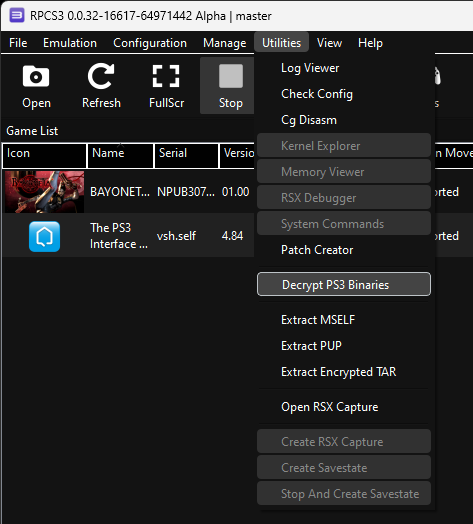

# Playstation 3 Executable Corruptions

This guide explains the process of corrupting PS3 executables using FileStub and RPCS3, the PS3 emulator. The PS3 used two different types of cores, with one main processor called the _Power Processing Element (PPE)_ and eight co-processors called _Synergistic Processing Element (SPE)_. These used different instruction sets, with the PPE using PowerPC (PPC), and the SPE using a unique instruction set simply called SPU ISA.

As corrupting PS3 games is a bit more laborious, this guide expects the user to already have an understanding of how to corrupt other game engines (especially GC/Wii games in Dolphin, as these use the same instruction lists).

## Why this guide? <a href="#h.y1937o2xm6iv" id="h.y1937o2xm6iv"></a>

With RPCS3, the PPC instructions are unfortunately precompiled with Ahead-of-Time (AOT) instead of Just-in-Time (JIT). What this means is that the instructions are not available to RPCS3-Vanguard for corruption (unlike the SPU ISA, which can be targeted by loading the SPE memory domains). The workaround to this is corrupting the PPC instructions before compilation using FileStub, and then running the game. The benefit to this is being able to use a newer version of RPCS3, which has added new features/better optimization over the years.

## Preparing the workflow <a href="#h.ld6ndzumx2wk" id="h.ld6ndzumx2wk"></a>

This guide assumes that you have already dumped your game and installed it into RPCS3.

An important first step if you are corrupting a disc based game: navigate to the folder the game is installed in (RPCS3/games/$game\_name) and rename $game\_name to the product code of that game (this can been seen under the _Serial_ label in the _Game List_). This is required if you are using the helper .bat file described later in this guide.

Navigate to _Utilities_ > _Decrypt PS3 Binaries_, then navigate to the folder that contains EBOOT.BIN (RPCS3/dev\_hdd0/game/$product\_code/USRDIR for HDD based games, and RPCS3/games/$product\_code/PS3\_GAME/USRDIR for disc based games). The folder containing the EBOOT.BIN will create a new file called EBOOT.elf.

<figure><figcaption><p>Decrypt Binaries Path</p></figcaption></figure>

<figure><figcaption><p>Newly created EBOOT.elf file</p></figcaption></figure>

One thing to note is that if there is a .self file in the folder (as seen above), you’ll want to either remove it from the folder or change it’s filetype so it is not .self. Without doing this, the cache will not generate correctly.

After this, you can navigate to _File_ > _Boot (S)Elf_ > _Boot SELF/ELF_ and select the EBOOT.elf to start the game. Let this finish compiling the modules, then close out of the game and RPCS3.

<figure><figcaption><p>Boot SELF/ELF path</p></figcaption></figure>

The final step is to create a helper batch script that will automate the process of changing the compiled folder to the correct name. Whenever you apply a corruption, the cache folder’s name will change. The following code block is an example of a .bat file placed in the USRDIR folder, where the EBOOT.elf file is.

```batch
@echo off
::close RPCS3 if it was already running, and wait to confirm it's been terminated
taskkill /im rpcs3.exe /f /t

:loop
Timeout /t 1 >NUL
tasklist.exe /FI "ImageName eq rpcs3.exe" /NH |find /i "rpcs3.exe" >NUL && Goto :loop

::find the product code for the selected game
::we also need to check if the game is HDD or Disc based
cd..
echo %cd%
for %%I in (.) do set "folder_name=%%~nxI"
echo %folder_name%
if %folder_name% NEQ PS3_GAME (
        echo hdd game
        set "game_type=0"
        for %%I in (.) do set "product_code=%%~nxI"
        cd../../..
)

if %folder_name%==PS3_GAME (
        echo disc game
        set "game_type=1"
        cd..
        for %%I in (.) do set "product_code=%%~nxI"
        cd../..
)

echo %product_code%

::start RPCS3
if %game_type% ==0 start rpcs3 --no-gui %cd%\dev_hdd0\game\%product_code%\USRDIR\EBOOT.ELF
if %game_type% ==1 start rpcs3 --no-gui %cd%\games\%product_code%\PS3_GAME\USRDIR\EBOOT.ELF
::wait until the new cache folder is created by RPCS3
cd %cd%\cache\%product_code%
setlocal enableextensions
echo waiting for new cache folder...
:watch_for_new_folder
set count=0
for /D %%A in (*-EBOOT.ELF) do set /a count+=1
if not %count%==2 goto watch_for_new_folder
endlocal

::once we have the new folder, close RPCS3 and store the hash code in the folder name
taskkill /im rpcs3.exe /f /t
for /f "delims=" %%i in ('dir /b /ad-h /t:c /od') do set "new_cache=%%i"
echo %new_cache%
for /f "tokens=2 delims=-" %%i in ("%new_cache%") do set "cache_hash=%%i"
echo %cache_hash%

::delete the new folder, then rename the original folder with the new hash code
RMDIR /S /Q %cd%\ppu-%cache_hash%-EBOOT.ELF
move "ppu-*-EBOOT.ELF" ppu-%cache_hash%-EBOOT.ELF

::restart RPCS3
echo starting RPCS3...
cd ..\..
if %game_type% ==0 rpcs3 %cd%\dev_hdd0\game\%product_code%\USRDIR\EBOOT.ELF
if %game_type% ==1 rpcs3 %cd%\games\%product_code%\PS3_GAME\USRDIR\EBOOT.ELF
```

Once you’ve done all this, you’re ready to start corrupting the game!

## A note on the cache folder <a href="#h.dnyjbh6n1vq3" id="h.dnyjbh6n1vq3"></a>

Depending on the type of list you use, RPCS3 may still have to recompile some modules. From current tests, it appears that anything from the classic vector lists (Extended, One, Two, etc.) will not require recompilation, while lists that change instructions (such as math instructions/branches) will require it, with the intensity increasing the number of modules affected. As this causes new files to be generated, the folder can start to grow quite quickly. It’s recommended to keep a backup of the originally cached folder so that you can easily return to a smaller folder size after corrupting for a while.

## Corrupting EBOOT.elf with FileStub

Now that our workflow is set up, you can open the RTC launcher and install both Dolphin (for the PPC instruction lists) and FileStub if you have not already, then start FileStub. The first thing you will want to do is click on the gear wheel in the top right and select _Big Endian_.

After this, click on _Advanced Options_ and under _Target execution_, select _Execute other program_ from the dropdown and then click _Edit Exec_. Select your .bat file created earlier so that it will run every time a corruption is applied.

The final step is to click Browse target and select the EBOOT.elf file, then click _Load targets into RTCV_ to begin corrupting.

<figure><figcaption></figcaption></figure>

<figure><figcaption><p>FileStub setup</p></figcaption></figure>

Now in the _Real-Time Corruptor_ window, click on _Engine Config_, and then under _Advanced Tools and Plugins_ click on _Package Downloader_. Click on _Lists_ and then download both the _DolphinFloatInstructions\_by\_NullShock78_ and _DolphinFloatPassthrough\_by\_NullShock78_.

<figure><figcaption></figcaption></figure>

Go back to _Engine Config_ and then click _My Lists_. Click _Import List File_, then go to your RTC folder and find the path to the Dolphin installation (usually found at _RTC/VERSIONS/RTCV\_version/Dolphin/LISTS_) and import all lists in the folder. Finally, click _Refresh Lists_.

One last time, go back to _Engine Config_ and under _Corruption Engine_ select _Vector Engine_. You are now ready to select your limiter/value lists and hit corrupt. Once clicked, the .bat file should run and automatically open up RPCS3.
