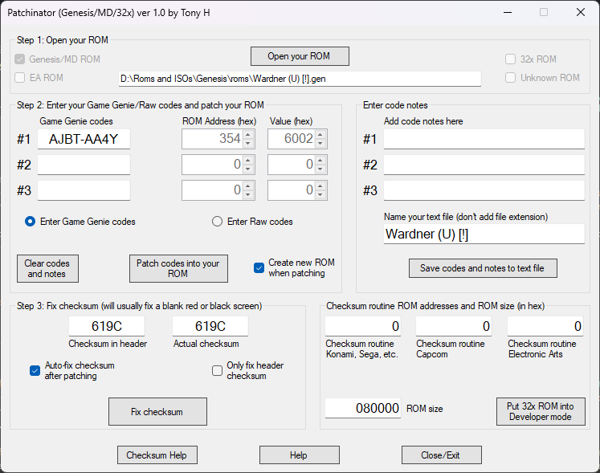

# Cracking the Checksum Routine

## Introduction

The vast majority of games on the Sega Genesis/Megadrive utilize a routine that the game initializes that performs a simple checksum on its ROM contents to ensure basic ROM integrity for proper operation. This was a simple method to ensure that the cartridge was making a solid connection with the console (unlike systems such as the NES where you could get a scrambled game). If the checksum fails, the game refuses to boot, usually displaying a red screen. This was why back in the day, Genesis Game Genie codes usually required you to put in a master code to circumvent this.

While this shouldn't be necessary when using most of RTC's functions, this is essential if you're using filestub or an alternative ROM corrupting solution, not to mention running your corruptions on real hardware. The following guide should walk you through how to properly crack the routine.


**Quick heads up!** Some games never check the checksum, so if you corrupt the ROM several times and you don't get a blank (red, blue, etc) screen, then you don't need to worry about it.


## Cracking the Routine

### Method 1: Using an Existing Game Genie Code (Easy)


**Good news everyone!** If you have a Master code, this is dead simple, just follow the guide below, and you're golden.


Back in 1992, Galoob came out with the Game Genie for the Sega Genesis. Due to how the Game Genie worked, intercepting reads from ROM and returning a different value meant that it would break any checksum routine that was run. To circumvent this, affected games needed a "master code" for any other code to work. All this master code did was to circumvent the checksum, meaning the Game Genie developers did all the hard work for us. However, we still need to decode the Game Genie code and patch it in the ROM. To do this, we are going to use the ROM hacking tool Patchinator. For this example, we are going to use the game Wardner.

Download link to : [Patchinator V10](https://cdn.discordapp.com/attachments/1137901970087227462/1220465815464185946/PatchinatorV10.zip?ex=660f0a5d\&is=65fc955d\&hm=3777698839a12903a4d8a1f3a9565838cbbaa3f19ff2cdf89bfd22e232b972de&)

The master code for Wardner is AJBT-AA4Y. So, the first step is to open Patchinator and open the ROM in step 1 at the top. Then, all you have to do is paste the code in step 2, and then click on "patch codes into your ROM." If you want the program to make a new ROM, thereby preserving the original copy, then make sure to check "create new ROM when patching." It should look something like this:



Congratulations, your ROM is ready for file corrupting!

### Method 2: Using a Debugger to Crack the Routine Yourself (Intermediate)


**Heads up!** The following guides require beginner to intermediate ASM skills. Keep that in mind and proceed with caution.



**Tip:** Using Bizhawk for debugging is not recommended. Use an emulator with a functional debugger, such as Exodus or Regen.


For this tutorial, we are going to pick a Genesis game at random, which will be Rambo III.

The best way to find the checksum routine is to see when it reads from offset 0x018E, which is the internal checksum for the ROM.

For this example, we're going to be using [Exodus](https://www.exodusemulator.com/) as the emulator. Once you have the ROM loaded, you're going to want to go to debug, then Mega Drive, then 68000, then watchpoints. From there, you're going to set a watchpoint for the address 0x18E. (See below)


Now, reset the game (and make sure to run it if it's paused!) and wait for the breakpoint to trigger. If it doesn't, it's likely due to one of two reasons.

* The game doesn't give a shit about the checksum, so you should be able to corrupt the game to your heart's content.
* The game is quite frankly evil and it figured it's better to use its _own_ checksum handling routine (See Method 3).

If successful, you're going to see a screen like this. What we are looking for is a compare instruction (CMP) followed by a branch instruction (BEQ/BNE).


Now, these two instructions are often seen hand in hand. The **CMP** instruction compares 2 values together. This is followed by a **branch** instruction that tells the CPU to jump to a new location, depending on the result of the comparison. This is essentially the foundation of conditional logic, which is what is needed for CPUs to essentially make simple decisions, based on various inputs. Otherwise, they'd be just glorified linear calculators. (other operations can affect the behavior of branch instructions, but that's a topic for another time)

In this example, we can see that it's using a **BEQ** instruction, which means **B**ranch on **Eq**ual. Essentially, this means that if the checksums match, jump to this location, otherwise continue. We want to software to always think that the checksums match, so the best way to do that in this case would be to make the instruction **Br**anch **A**lways, or change **BEQ** to **BRA**. Luckily for us, this is a very simple edit, by looking at the Sonic Retro's [ASM-to-Hex\_Code\_Reference](https://info.sonicretro.org/SCHG:68000\_ASM-to-Hex\_Code\_Reference), we can see that the BEQ instruction starts with the byte 0x67. If we change it to 0x60 (BRA) in your hex editor of choice, it'll always branch ahead, regardless of the comparison!

But what if it uses a **B**ranch if **N**ot **E**qual instruction? Well, that would mean that it would branch if the checksum **fails**. Since there isn't a "branch never" instruction, because that would be rather useless, we need to take a slightly different approach. This will vary based on how long the instruction is.

**16-bit branch:** This is a branch where the instruction bytecode will look something like this: `66 00 12 34`. For this example, you would replace `12 34` with `00 02`. This will negate the branch, telling it to essentially jump to the following instruction regardless of the condition. You can find an example of this in the video shown below:


Brad walks you through step by step on how to crack the checksum routine in a Genesis game. Source: [Brad Corrupts](https://www.youtube.com/@BradCorrupts)


**8-bit branch:** This is a branch where the instruction bytecode will look something like this: `66 12`. Due to how the 68000 encodes instructions, we can't negate the branch like how we did it above. This time, we're going to replace it with **N**o **OP**eration, which is an operation that does literally nothing. This is equivalent to commenting out a line of code. Using the [aforementioned guide above](https://info.sonicretro.org/SCHG:68000\_ASM-to-Hex\_Code\_Reference), we can see that the NOP opcode is `4E 71`, so that is what you would write **over** the branch. Once the branch has been overwritten with NOP, then you're good to go, have fun.

### Method 3: Using a Debugger to Crack an Evil, Custom-Made, Checksum Routine Yourself (Advanced)

Sometimes, you'll encounter a game that decides to be a rebel and says "Fuck the system, I'll use my own damn checksum routine!" This is often done by a well-known and _very well respected_ developer, Electronic Arts.


**Fun Fact:** This type of routine was discovered as the editor was writing this guide. Supposedly, he managed to luck out for your benefit. Cheers!



**Fun Fact #2:** Since its inception, EA has always been the pioneer of trying creative ideas in the gaming industry in the worst ways possible. This trend continues to this day.



**Caution:** There will be a lot less hand-holding in this guide than the others. Intermediate debugging skills are essential.


For this example, we will be using NHL Hockey. For this one, open up Exodus (which we'll be using for this example, feel free to use whatever competent debugging tools suit you best), and open up the debugger and watchpoint windows. From there, pause emulation and create a read watchpoint for somewhere in the middle of the ROM, a place that is most likely not going to be accessed by any other initialization routine (for this game, somewhere around 0x40000 is fine). Now, reset the game, then run it. Almost immediately, it should break and you should see the following down below, which is stored at the very end of ROM, oddly enough.

```
	MOVEQ	#0, D0				;Initialization
	SUBA.l	A0, A0
	MOVE.l	#$0001FFA3, D1		;Length of ROM * 4.
loc_0007FE96:
	CMPA.w	#$018C, A0			;Check to see if it's about to read the actual official checksum, because lol.
	BNE.b	loc_0007FEA0		;If it does, skip check/adding it, otherwise continue (probably to make its own checksum calculation simpler).
	ADDQ.w	#4, A0			
	BRA.b	loc_0007FEA2
```

What we care about is this section of code down below. Here, you can see it adds the ROM contents 32 bits at a time, then when it's done, it does a compare with its own _special_ 32-bit checksum. NOPing the branch afterward will crack the routine.

```
loc_0007FEA0:
	ADD.l	(A0)+, D0			;Add the next part of ROM to the data check register, it's gonna break here.
loc_0007FEA2:
	SUBQ.l	#1, D1				;Decrement ROM length.
	BGT.b	loc_0007FE96		;If greater than 0, keep looping.
	CMPI.l	#$9BB2FE9B, D0		;What, EA? 16-bit checksums not good enough for you? I think you're overcompensating for something.
	BNE.b	loc_0007FEB0		;This is what we want. this is a BNE.b (8-bit), so you want to replace this with a NOP. (This is at offset 0x07FEAC)
	RTS							;If it passes, however, return.
```

However, if you let it fail, it decides to be fancy and make a nice horizontal line pattern, because fuck it, why not? (Did I mention that EA was special?)

```
loc_0007FEB0:
	MOVEA.l	#$00C00004, A4		;Start rendering the kill screen (they decided to go fancy with it).
	MOVE.w	#$8F02, (A4)	
	MOVE.w	#$8004, (A4)	
	MOVE.w	#$8700, (A4)	
	MOVE.w	#$8144, (A4)	
	MOVE.w	#$C000, (A4)	
	MOVE.w	#$003F, D1			;Init loop
loc_0007FECE:
	MOVE.w	#$000E, $00C00000	;Short loop to make the "lines."
	DBF	D1, loc_0007FECE	
loc_0007FEDA:
	BRA.b	loc_0007FEDA		;Infinite loop, crashing the game
```

In a nutshell, that's how you would crack an EA game. Just note that there could be other developers that have their own routines, but the method for finding them should be more or less the same.
