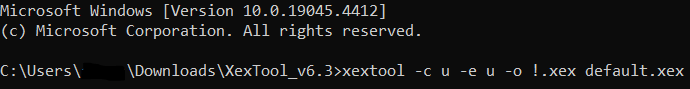

# Xbox 360 Executable Corruptions (Real Console)

using a JTAGed/RGHed Xbox 360 and FileStub

This guide explains how to get Xbox 360 corruptions working using FileStub and a JTAGed/RGHed Xbox 360. This method allows for Xbox 360 corruptions, but ultimately it is a slow and tedious process due to the lack of savestates.

**DISCLAIMER: THIS IS THE GUIDE FOR REAL CONSOLE. IF YOU WANT TO USE XENIA PLEASE FOLLOW THE OTHER GUIDE.**

## **Extracting the Files**

### Disc

This guide is assuming you have Aurora as your modded dashboard on your Xbox 360, as well as a FAT32 formatted USB drive to reliably transfer and edit files between your Xbox 360 and PC. Insert your disc into your Xbox 360. Press the select button to open the system menu and go into the file manager. Go to the DVD drive and select all folders and files. Copy the files and go to your USB drive. Create a folder for your game and paste the files in that folder. You should now have the files for the game you want to corrupt. Note that if the disc default.xex just launches an XBLA title file (disc games like Minecraft) you will need to follow the XBLA guide instead.&#x20;

<figure><figcaption>
A screenshot of the Minecraft disc. Notice the small Default.xex and Content folder? That most likely means that the disc is an XBLA game and the XBLA title in the Content folder should be extracted instead.
</figcaption></figure>

### **GOD/Games on Demand** 

This guide is assuming you have Aurora as your modded dashboard on your Xbox 360, as well as a FAT32 formatted USB drive to reliably transfer and edit files between your Xbox 360 and PC. Press the select button to open the system menu and go to HDD1 -> Content -> 0000000000000000. Here are all your installed XBLA, GOD and Indie games installed on your Xbox 360. The way to tell the difference between if the game is a GOD, XBLA or Indie game is to see the contents of the folders. GOD games have a 00007000 folder and inside that folder is a file that is a bunch of letters and numbers and a folder that is the same name just with “.data” at the end. Inside that folder is a bunch of data files starting with “Data0000”. XBLA games have a 000D000 (Indie games are 00000002) folder that just contains a file with a bunch of letters and numbers.&#x20;

The folders will be the title ids of the games. Aurora should automatically show the actual game name next to the title id but if for whatever reason it’s not showing up you can go to [Microsoft Xbox 360 games list with Title ID (gamesdatabase.org)](https://www.gamesdatabase.org/xbox\_360\_games\_list\_with\_title\_ids) to see what title id the game you want is.

After you find the game you are looking for you can copy the title id folder containing the game and paste it onto your USB drive. After the files are done copying, put the USB drive into your PC. Next, you’re going to want to download a program called “god2iso” in order to convert the file into iso format. You can get it from here: [God2ISO - Xbox 360 Games on Demand to CD Image Converter | Digiex](https://digiex.net/threads/god2iso-xbox-360-games-on-demand-to-cd-image-converter.7115/#google\_vignette). Launch the “God2Iso.exe” file from the download and add a GOD package. Go to your USB drive and open the folder of the game you put on there. Go into the 00007000 folder and add the file that is a bunch of letters and numbers (not the folder that has .data at the end).&#x20;

Choose an output directory and press the “Go!” button.&#x20;

After it is done you will find an iso that has the same name as the GOD package you added. Now you need to download a program called “isoextract” which you can get from here: [Xbox 360 XISO Extract - BEST an easiest XDG3 extraction tool, with GUI + FTP. | Digiex](https://digiex.net/threads/xbox-360-xiso-extract-best-an-easiest-xdg3-extraction-tool-with-gui-ftp.9711/). Launch the “XBOX360 ISO Extract.exe” file from the downloaded program. Choose the ISO folder and the destination for the extracted files to go. After you are done choosing, press the “go” button.&#x20;

You should now have the files of the game you want to corrupt.

### **XBLA/Xbox Live Arcade** 

This guide is assuming you have Aurora as your modded dashboard on your Xbox 360, as well as a FAT32 formatted USB drive to reliably transfer and edit files between your Xbox 360 and PC. Press the select button to open the system menu and go to HDD1 -> Content -> 0000000000000000. Here are all your installed XBLA, GOD and Indie games installed on your Xbox 360. The way to tell the difference between if the game is a GOD, XBLA or Indie game is to see the contents of the folders. GOD games have a 00007000 folder and inside that folder is a file that is a bunch of letters and numbers and a folder that is the same name just with “.data” at the end. Inside that folder is a bunch of data files starting with “Data0000”. XBLA games have a 000D000 (Indie games are 00000002) folder that just contains a file with a bunch of letters and numbers.The folders will be the title ids of the games. Aurora should automatically show the actual game name next to the title id \[Image 3] but if for whatever reason it’s not showing up you can go to [Microsoft Xbox 360 games list with Title ID (gamesdatabase.org)](https://www.gamesdatabase.org/xbox\_360\_games\_list\_with\_title\_ids) to see what title id the game you want is. After you find the game you are looking for you can copy the folder containing the game and paste it onto your USB drive. After the files are done copying, put the USB drive into your PC. Next, you’re going to want to download a program called “wxPirs” in order to extract the files of the XBLA title. You can get it from here: [Wxpirs - extract content from Xbox 360 Demos, Video DLC and Arcade game containers | Digiex](https://digiex.net/threads/wxpirs-extract-content-from-xbox-360-demos-video-dlc-and-arcade-game-containers.9464/#google\_vignette). Launch the “wxPirs.exe” file from the program you downloaded. Press open file in the program and go to the folder where you copied your XBLA title file to. Go to the 000D0000 folder and open the file there. After opening the file in the program, extract all files into a folder on your USB drive (preferably with the name of the game you are extracting).&#x20;

&#x20;You should now have the files of the game you want to corrupt.

### **Indie Games** 

The process for extracting files from Indie games is similar to XBLA but there is currently no way to corrupt them. There may be some way some time in the future.

## **Decompressing and Unencrypting the XEX**

No matter the method you used to extract the files, you should have a “default.xex” file in the root folder of the game you extracted. This file needs to be decompressed and unencrypted before being able to be corrupted. In order to do this, you’re going to need a tool called “XexTool”, which you can get here: [XEXTool 6.3 Download | Digiex](https://digiex.net/threads/xextool-6-3-download.9523/). Alternatively, if you prefer to use a GUI tool, you can use a program called “Xbox 360 Game Hack”, which you can download here: [Xbox 360 Game Hack 6.3 - Patch Xbox 360 .xex files (patch region, media, kinect) | Digiex](https://digiex.net/threads/xbox-360-game-hack-6-3-patch-xbox-360-xex-files-patch-region-media-kinect.7430/#post38498), although note that this guide will be using the command line tool. Copy over the default.xex file to the folder where “xextool.exe” is stored.&#x20;

&#x20;In file explorer, there is a bar to the left of the search bar that shows the path to the current directory you’re in (should be the XexTool folder). Click the empty space in that bar,&#x20;

The red arrows point to the empty space.

&#x20;type “cmd”&#x20;

and press enter. Command prompt should now open. To keep things simple, just type in “xextool -c u -e u -o !.xex default.xex” without the quotes.&#x20;

&#x20;“!.xex” can be whatever you want, but it is recommended that you keep it as “!.xex” as the ! character shows up the highest in file explorers and it could take a while to launch the XEX file every time if it isn’t at the top of the file list. Copy the “!.xex” file to the root of the extracted game folder on your USB drive. The unmodified default.xex should be there alongside your newly decompressed and unencrypted !.xex file.

## **Corrupting and Loading**

### **Corrupting the XEX** 

First thing’s first, you should make 4 copies of the !.xex so you have 5 modified XEX files. This is recommended as you will have to unplug and replug the USB drive into your PC and Xbox 360 over and over again and having multiple different corrupted files lowers the downtime between corruption attempts a lot.&#x20;

Open the RTC launcher and download Dolphin. Download FileStub if you haven’t already and open it. Click the settings icon in the top right corner of FileStub and turn Big Endian on. Change the target type to multiple files (many domains). Add the modified !.xex and the 4 copies you have created into FileStub. Click load targets into RTCV.

Change the blast radius to normalized and the corruption engine to vector. Click the “My Lists” button and then click “Import List File”. Go to your RTC folder and go into VERSIONS -> RTCV\_(version) -> Dolphin -> LISTS and import all of the lists in this folder.

Go back to engine config and click on the “Package Downloader” button. Go to LISTS and download the following lists: [DolphinFloatInstructions\_by\_NullShock78.pkg](http://cc.r5x.cc/rtc/packages/CATALOG\_3/LISTS/DolphinFloatInstructions\_by\_NullShock78.pkg) and [DolphinFloatPassthrough\_by\_NullShock78.pkg](http://cc.r5x.cc/rtc/packages/CATALOG\_3/LISTS/DolphinFloatPassthrough\_by\_NullShock78.pkg).

Go back to “My Lists” and click “Refresh List Files”. Go back to engine config. The new list files should be there now. Now it’s finally time to do your first test corruption. For the limiter, set the list to be \_Dolphin\_PT\_FLT\_MATH and set the value to be the same. This is a great beginning combo.&#x20;

&#x20;The guide will detail other list combinations later. Open up the Glitch Harvester. You’re going to want to go for a layer size of around 500 (around 100 units for each of the XEXs).

Play around with the intensity to see if you can get around that range. Too little and you’re not going to see much broken stuff, too much and all you’ll see is bars stretched across your screen. The amount of blast units you’ll get depends on the lists you use and the XEX size. If you’re getting way too many or way too little, make sure you have Big Endian set in FileStub or didn’t accidentally increase the alignment past 0. Once you feel like you have the right layer size, proceed to the next step.

### **Loading the Corrupt XEX** 

Once you have corrupted the files you should be ready to load them. Double check to make sure you have the extracted files on your USB drive and the corrupted XEX files are in the root game folder along with the uncorrupted default.xex. Plug the USB drive into your Xbox 360. Press the select button to open the system menu and open the file manager. Go to your USB drive and go to the extracted game folder. Launch one of the 5 corrupted XEX files.

Congratulations! You have (hopefully) successfully done your first Xbox 360 corruption. If the game crashes on the first one you load, try another one, you may have gotten unlucky. If you want to load another corruption you don’t even have to quit back to the Aurora menu. Press the Xbox button, go to File Browser, navigate to your USB drive and game folder and you can load a different XEX from there.

## **List Combinations and Info**

Here are some of the lists and combinations that have been tested and work well. If a list is not listed here, that probably means it should be avoided unless you know what you're doing.\
Guide: (limiter) -> (value)

\_Dolphin\_PT\_FLT\_MATH -> \_Dolphin\_PT\_FLT\_MATH\
This is what you should use if you’re just beginning, it is the least crashy out of everything that will be here but it is not completely crash proof.

\_Dolphin\_FLT\_DBL\_GIGA -> \_Dolphin\_FLT\_DBL\_GIGA\
Medium crashiness. Gives various unique results when compared to other things on here.

\_Dolphin\_FLT\_DBL\_MATH -> \_Dolphin\_FLT\_DBL\_MATH\
Medium crashiness. Gives less results than \_Dolphin\_FLT\_DBL\_GIGA.

\_Dolphin\_FLT\_LOAD -> \_Dolphin\_NOP\
Most crashy. One of the most difficult ones there are here while still at least semi-consistently being able to get results. Requires lower intensity than others to not get crashes.

\_Dolphin\_FLT\_STORE -> \_Dolphin\_NOP\
Most crashy. One of the most difficult ones there are here while still at least semi-consistently being able to get results. Requires lower intensity than others to not get crashes.

\_Dolphin\_FMR -> \_Dolphin\_NOP\
Not all that crashy, but results mostly consist of unplayable and unwatchable screen warping. Results and success very much vary per game. Requires high intensity to get even remotely anything. Provides the most unique effects out of anything here when you aren’t looking at an enlarged concrete texture covering your entire screen.

## **Potential Weird Scenarios**

Sometimes, it’s not as simple as decompressing and decrypting the default.xex and corrupting it. There may be some scenarios where you need to do more.

### **Corrupting Games With Title Updates** 

You should generally avoid trying to use Title Updates while corrupting games. Applying the Title Update while also corrupting is highly inconvenient and unnecessary for most games as most are only bug fixes. There are some games however, with massive amounts of Title Updates that make the game what it is (Minecraft, Terraria etc.) If you insist on corrupting games with Title Updates, first of all you need to obtain the Title Update file. If you did the GOD or XBLA method, you may already find that the Title Update folder (000B0000) is already there. If you have used the Disc method go to HDD1 -> Content -> 0000000000000000 and find the title id of the game on your disc. If you downloaded the Title Update, inside the title id folder should be the Title Update folder (000B0000). Go into the Title Update folder and copy the Title Update file onto your USB drive. If you were using this guide for corrupting an XBLA game, you should already have the wxPirs tool. If not, you can download it from here: [Wxpirs - extract content from Xbox 360 Demos, Video DLC and Arcade game containers | Digiex](https://digiex.net/threads/wxpirs-extract-content-from-xbox-360-demos-video-dlc-and-arcade-game-containers.9464/#google\_vignette). Do what you would for the XBLA title but instead open the Title Update file. Extract the Title Update files to the same folder as the game (if it overwrites files don’t worry about it).&#x20;

You will notice how there is now a “default.xexp” file next to the normal default.xex file. This is the patch file for the default.xex file. Copy over both files to the xextool folder.&#x20;

To patch it, type in the following command: “xextool -p default.xexp default.xex”&#x20;

<figure><figcaption></figcaption></figure>

without quotation marks. After you do that you’re going to need to fix it so it doesn’t need a separate patch file. To do that type “xextool -u default.xex”.&#x20;

<figure><figcaption></figcaption></figure>

&#x20;Then, you’re going to want to remove all XEX limitations. To do that type “xextool -r a default.xex”.&#x20;

<figure><figcaption></figcaption></figure>

Finally, after all that you can decompress and unencrypt the XEX file. Remember, you can do that by typing “xextool -c u -e u -o !.xex default.xex”. Now, copy the XEX five times, corrupt them and put your USB drive into the Xbox 360.&#x20;

<figure><figcaption></figcaption></figure>

This time, you can’t just run the XEX file directly. In order for the Title Update to get applied you need to launch the original unmodified game (the one that was on your Xbox 360 already, not the extracted one)&#x20;

<figure><figcaption>
Launch the game through here (or the disc if you are using a disc).
</figcaption></figure>

and then from there you can open the file browser while in the game and launch the corrupted XEX file.&#x20;

<figure><figcaption></figcaption></figure>

Only then will the Title Update be applied to the corrupted XEX.

### **Corrupting Games With “DLL” Files** 

There is this weird case scenario with Valve games on the Xbox 360 (and Terraria with no Title Update) where there are “DLL” files (they’re just XEX files disguised as a DLL file) running alongside the normal default.xex. Valve games are currently the only known games that are like this, but there are more than likely other games on the Xbox 360 that are like this that this guide would help with. To tell if you should be corrupting the “DLL” files and not the default.xex, look at the size of the default.xex compared to the “DLL” files. If the default.xex doesn’t even reach the megabyte range, the “DLL” files are more than likely the files you want to corrupt. In order to corrupt these types of games, you need to decompress and decrypt the “DLL” files like any normal XEX file. You don’t even want to touch the default.xex as it will cause the game to crash on boot when loading a modified one. For this guide, we will be using the game “Portal: Still Alive”. The common “DLL” files you want to corrupt are “engine\_360.dll”, “vphysics\_360.dll”, “MaterialSystem\_360.dll”, “shaderapidx9\_360.dll” and “stdshader\_dx9\_360.dll”. You can corrupt the other “DLL” files if you want. Decompress and decrypt those files, but you may want to decompress all the “DLL” files just in case you want to have those at the ready.&#x20;

<figure><figcaption></figcaption></figure>

<figure><figcaption>
Being able to have all “DLL” at the ready to corrupt is very useful.
</figcaption></figure>

&#x20;After you decompress and decrypt the “DLL” files, you will need to straight up replace the unmodified “DLL” files with the modified ones. Therefore, it is impossible to do the method of creating multiple copies of the files in order to decrease the downtime of corruptions. After you have replaced all of the “DLL” files of the game on the USB drive, you will need to add all of the “DLL” files into RTC.&#x20;

<figure><figcaption></figcaption></figure>

The corruption settings you should use are like before except for a few things. Instead of using a normalized blast radius, you’ll want to use a spread or even blast radius. You’ll also want to have a layer size of around 80 if you’re only corrupting the common “DLL” files mentioned earlier as the game is a lot more sensitive than most. This may not be the case for other games. You may want to try to get a bigger layer size if you are corrupting more of them. After you are done corrupting the files plug the USB drive into your Xbox 360 and load the normal default.xex and the game should be corrupted.

## **Notes**

You don’t have to just use 5 copies of the XEX. Create as many as you see fit. Just make sure that you increase the intensity and the layer size you should be looking for the more copies you add.

You may sometimes find that the XBLA games you own are in trial mode now. This is due to the fact that you are offline **(at least you should be offline, don’t use corruptions while connected online).** To fix this, in Aurora press Y on the game that is forcing you into trial mode. Stay on the launch button and press the d-pad left 2 times. Instead of launch it should say settings now. Press A and enable the settings override. For the DashLaunch Settings turn on Content Patching, XBLA Patching and License Patching.&#x20;

<figure><figcaption></figcaption></figure>

You need to download Dolphin as the \_Dolphin\_NOP list is only accessible if Dolphin Vanguard is downloaded.

The \_Dolphin\_PT\_FLT\_MATH, \_Dolphin\_PT\_FLT\_ADD, \_Dolphin\_PT\_FLT\_SUB and \_Dolphin\_PT\_FLT\_DIV lists can be mixed around (MATH is the only one that can be used against itself though). For example, Use \_Dolphin\_PT\_FLT\_ADD with \_Dolphin\_PT\_FLT\_SUB to turn addition floats into subtraction floats.

Sanitization is possible but not recommended as you will have to constantly switch between devices and unplugging and replugging in the USB drive. You can do it if you want but expect 30 minutes to an hour of tedious work.

With how unique the Xbox 360 can be with what developers can do with it there may be some extra weird scenarios that may not be mentioned in this guide. We don’t own everything/can’t test everything so if you find something odd that prevents your corrupting experience please join the RTC Discord so we can help solve issues and add solutions to the Wiki.

